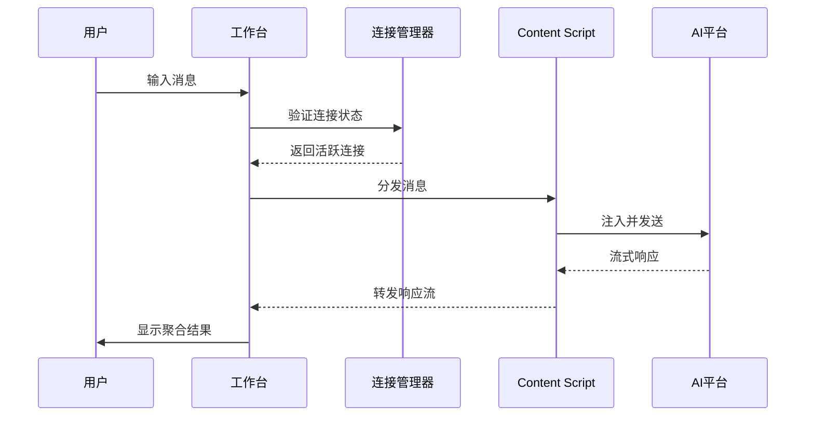

# OmniChat 产品开发文档 (PRD) - v2

| **文档版本** | **日期** | **作者** | **状态** | **修订说明** |
| :--- | :--- | :--- | :--- | :--- |
| 2.0 | 2025年8月27日 | Claude | 更新稿 | 增加技术架构细节、连接管理机制、状态管理方案 |
| 1.0 | 2025年8月25日 | Gemini | 草案 | 初始版本 |

## 1. 产品概述

### 1.1 产品名称
**OmniChat** - 多平台AI协作工作台

### 1.2 产品定位
OmniChat是一个基于浏览器扩展技术的AI协作中间件，通过统一的工作台界面，实现对多个Web端AI平台的并行交互、结果聚合和对比分析。

### 1.3 核心价值主张
- **效率提升**: 将N次操作简化为1次，减少80%的重复性工作
- **质量对比**: 同一提示词的多维度响应对比，获得最优结果
- **工作流优化**: 建立可复现、可追溯的AI实验流程
- **成本优化**: 通过对比选择最适合的AI服务，避免过度依赖单一平台

### 1.4 产品架构概览
```
┌─────────────────────────────────────────────────┐
│                 OmniChat 工作台                  │
│  ┌──────────┐  ┌──────────┐  ┌──────────┐     │
│  │连接管理器│  │消息分发器│  │结果聚合器│     │
│  └─────┬────┘  └─────┬────┘  └─────┬────┘     │
│        │             │              │           │
├────────┼─────────────┼──────────────┼───────────┤
│        ▼             ▼              ▼           │
│  ┌──────────────────────────────────────┐      │
│  │     Content Script Injection Layer    │      │
│  └──────────────────────────────────────┘      │
│        ▲             ▲              ▲           │
├────────┼─────────────┼──────────────┼───────────┤
│   [ChatGPT]     [Claude]      [Gemini]   ...    │
└─────────────────────────────────────────────────┘
```

## 2. 技术架构详述

### 2.1 系统组件架构

#### 2.1.1 核心组件定义

```typescript
// 组件接口定义
interface IOmniChatComponent {
  id: string;
  name: string;
  version: string;
  initialize(): Promise<void>;
  destroy(): Promise<void>;
}

// 平台适配器接口
interface IPlatformAdapter extends IOmniChatComponent {
  platformId: PlatformType;
  connectionState: ConnectionState;
  capabilities: PlatformCapabilities;

  connect(): Promise<ConnectionResult>;
  disconnect(): Promise<void>;
  sendMessage(message: Message): Promise<void>;
  cancelGeneration(): Promise<void>;
  getResponseStream(): AsyncIterator<ResponseChunk>;
}

// 连接状态枚举
enum ConnectionState {
  DISCONNECTED = 'disconnected',
  CONNECTING = 'connecting',
  CONNECTED = 'connected',
  ERROR = 'error',
  UNAUTHORIZED = 'unauthorized'
}
```

#### 2.1.2 消息流架构



### 2.2 连接管理机制

#### 2.2.1 连接生命周期

```typescript
class ConnectionManager {
  private connections: Map<PlatformType, PlatformConnection>;
  private heartbeatInterval: number = 5000; // 5秒心跳

  async establishConnection(platform: PlatformType): Promise<ConnectionResult> {
    // 1. 检测标签页存在性
    const tab = await this.findPlatformTab(platform);
    if (!tab) {
      return { success: false, error: 'TAB_NOT_FOUND' };
    }

    // 2. 注入Content Script
    await chrome.scripting.executeScript({
      target: { tabId: tab.id },
      files: [`adapters/${platform}/content.js`]
    });

    // 3. 建立双向通信通道
    const port = chrome.tabs.connect(tab.id, { name: `omnichat-${platform}` });

    // 4. 验证连接（握手协议）
    const handshake = await this.performHandshake(port);
    if (!handshake.success) {
      return { success: false, error: 'HANDSHAKE_FAILED' };
    }

    // 5. 启动心跳监测
    this.startHeartbeat(platform, port);

    // 6. 更新连接状态
    this.connections.set(platform, {
      state: ConnectionState.CONNECTED,
      port: port,
      capabilities: handshake.capabilities,
      lastHeartbeat: Date.now()
    });

    return { success: true, connectionId: handshake.connectionId };
  }

  private startHeartbeat(platform: PlatformType, port: chrome.runtime.Port): void {
    setInterval(() => {
      port.postMessage({ type: 'HEARTBEAT', timestamp: Date.now() });
    }, this.heartbeatInterval);
  }
}
```

#### 2.2.2 连接状态管理

| 状态 | 触发条件 | 后续动作 | UI表现 |
|------|---------|----------|--------|
| **未连接** | 初始状态/用户断开 | 显示连接按钮 | 灰色图标 + "点击连接" |
| **连接中** | 用户点击连接 | 执行连接流程 | 旋转动画 + "连接中..." |
| **已连接** | 握手成功 | 启用消息发送 | 绿色图标 + "已连接" |
| **连接异常** | 心跳超时/错误响应 | 自动重连(3次) | 黄色图标 + "重连中" |
| **连接失败** | 标签页关闭/网络错误 | 禁用该平台 | 红色图标 + 错误信息 |

### 2.3 消息分发与状态追踪

#### 2.3.1 消息分发策略

```typescript
interface MessageDispatcher {
  // 广播配置
  broadcastConfig: {
    mode: 'parallel' | 'sequential';  // 并行或顺序发送
    timeout: number;                   // 单平台超时时间
    retryPolicy: RetryPolicy;         // 重试策略
  };

  // 分发消息
  async dispatch(message: UserMessage, targets: PlatformType[]): Promise<DispatchResult> {
    const tasks = targets.map(platform => ({
      platform,
      status: 'pending',
      startTime: null,
      endTime: null,
      result: null
    }));

    // 并行模式：同时发送
    if (this.broadcastConfig.mode === 'parallel') {
      return Promise.allSettled(
        tasks.map(task => this.sendToPlatform(task.platform, message))
      );
    }

    // 顺序模式：依次发送（用于限流场景）
    for (const task of tasks) {
      await this.sendToPlatform(task.platform, message);
    }
  }
}
```

#### 2.3.2 平台独立状态机

```typescript
enum MessageState {
  IDLE = 'idle',                    // 空闲
  QUEUED = 'queued',               // 队列中
  SENDING = 'sending',             // 发送中
  WAITING_RESPONSE = 'waiting',    // 等待响应
  RECEIVING = 'receiving',         // 接收中
  COMPLETED = 'completed',         // 完成
  FAILED = 'failed',              // 失败
  CANCELLED = 'cancelled'          // 已取消
}

class PlatformStateManager {
  private states: Map<string, MessageState> = new Map();

  transition(messageId: string, platform: PlatformType, newState: MessageState): void {
    const key = `${messageId}-${platform}`;
    const oldState = this.states.get(key);

    // 状态转换验证
    if (!this.isValidTransition(oldState, newState)) {
      throw new Error(`Invalid state transition: ${oldState} -> ${newState}`);
    }

    this.states.set(key, newState);
    this.emitStateChange(messageId, platform, newState);
  }

  private isValidTransition(from: MessageState, to: MessageState): boolean {
    const transitions = {
      [MessageState.IDLE]: [MessageState.QUEUED],
      [MessageState.QUEUED]: [MessageState.SENDING, MessageState.CANCELLED],
      [MessageState.SENDING]: [MessageState.WAITING_RESPONSE, MessageState.FAILED],
      [MessageState.WAITING_RESPONSE]: [MessageState.RECEIVING, MessageState.FAILED],
      [MessageState.RECEIVING]: [MessageState.COMPLETED, MessageState.FAILED],
      // 任何状态都可以被取消（除了已完成和已失败）
    };

    return transitions[from]?.includes(to) || to === MessageState.CANCELLED;
  }
}
```

### 2.4 文件处理机制

#### 2.4.1 多平台文件能力检测

```typescript
interface PlatformCapabilities {
  supportsFiles: boolean;
  supportedFileTypes: string[];      // MIME types
  maxFileSize: number;               // 字节
  maxFileCount: number;              // 单次最大文件数
  fileUploadMethod: 'drag' | 'api' | 'input';  // 上传方式
}

// 平台能力配置
const PLATFORM_CAPABILITIES = {
  'chatgpt': {
    supportsFiles: true,
    supportedFileTypes: ['image/*', 'text/*', 'application/pdf'],
    maxFileSize: 10 * 1024 * 1024,  // 10MB
    maxFileCount: 10,
    fileUploadMethod: 'drag'
  },
  'claude': {
    supportsFiles: true,
    supportedFileTypes: ['image/*', 'text/*', 'application/pdf'],
    maxFileSize: 5 * 1024 * 1024,   // 5MB
    maxFileCount: 5,
    fileUploadMethod: 'api'
  },
  'gemini': {
    supportsFiles: true,
    supportedFileTypes: ['image/*'],
    maxFileSize: 20 * 1024 * 1024,  // 20MB
    maxFileCount: 1,
    fileUploadMethod: 'input'
  }
};
```

#### 2.4.2 统一文件处理流程

```typescript
class FileHandler {
  async processFiles(files: File[], targetPlatforms: PlatformType[]): Promise<FileProcessResult> {
    // 1. 验证文件兼容性
    const compatibility = this.checkCompatibility(files, targetPlatforms);

    // 2. 预处理文件（压缩、格式转换等）
    const processedFiles = await this.preprocessFiles(files, compatibility);

    // 3. 分发到各平台
    const results = await Promise.allSettled(
      targetPlatforms.map(platform =>
        this.uploadToPlatform(platform, processedFiles[platform])
      )
    );

    return this.aggregateResults(results);
  }

  private checkCompatibility(files: File[], platforms: PlatformType[]): CompatibilityMatrix {
    const matrix = {};

    for (const platform of platforms) {
      const caps = PLATFORM_CAPABILITIES[platform];
      matrix[platform] = {
        compatible: files.filter(f => this.isFileCompatible(f, caps)),
        incompatible: files.filter(f => !this.isFileCompatible(f, caps)),
        needsConversion: files.filter(f => this.canConvert(f, caps))
      };
    }

    return matrix;
  }
}
```

## 3. 用户界面与交互设计

### 3.1 工作台布局架构

#### 3.1.1 响应式布局策略

```css
/* 布局断点系统 */
:root {
  --breakpoint-xs: 480px;   /* 手机 */
  --breakpoint-sm: 768px;   /* 平板竖屏 */
  --breakpoint-md: 1024px;  /* 平板横屏 */
  --breakpoint-lg: 1280px;  /* 笔记本 */
  --breakpoint-xl: 1920px;  /* 桌面显示器 */
}

/* 自适应网格系统 */
.response-grid {
  display: grid;
  gap: var(--spacing-md);
  grid-template-columns: repeat(auto-fit, minmax(var(--card-min-width), 1fr));

  /* 根据平台数量动态调整 */
  --card-min-width: max(300px, min(600px, calc(100% / var(--platform-count))));
}

/* 视图模式切换 */
[data-view-mode="focused"] {
  /* 焦点模式：1个主要 + N个缩略 */
  grid-template-areas:
    "main main aside"
    "main main aside";
}

[data-view-mode="compare"] {
  /* 对比模式：2列并排 */
  grid-template-columns: 1fr 1fr;
}

[data-view-mode="overview"] {
  /* 概览模式：自适应网格 */
  grid-auto-flow: dense;
}
```

#### 3.1.2 防拥挤设计方案

```typescript
interface ViewOptimizer {
  // 根据活跃平台数量优化布局
  optimizeLayout(activePlatforms: number): ViewConfiguration {
    if (activePlatforms <= 2) {
      return {
        mode: 'side-by-side',
        cardSize: 'large',
        showFullContent: true,
        enableAnimations: true
      };
    } else if (activePlatforms <= 4) {
      return {
        mode: 'grid-2x2',
        cardSize: 'medium',
        showFullContent: true,
        enableAnimations: true
      };
    } else if (activePlatforms <= 6) {
      return {
        mode: 'compact-grid',
        cardSize: 'small',
        showFullContent: false,  // 显示摘要，点击展开
        enableAnimations: false  // 减少动画以提升性能
      };
    } else {
      return {
        mode: 'list-view',
        cardSize: 'minimal',
        showFullContent: false,
        enableAnimations: false,
        enableVirtualization: true  // 虚拟滚动
      };
    }
  }
}
```

### 3.2 实时反馈机制

#### 3.2.1 状态指示器设计

```typescript
// 平台状态可视化组件
const StatusIndicator = {
  // 连接状态
  connection: {
    disconnected: { icon: '○', color: '#gray', animation: 'none' },
    connecting: { icon: '◐', color: '#blue', animation: 'pulse' },
    connected: { icon: '●', color: '#green', animation: 'none' },
    error: { icon: '✕', color: '#red', animation: 'shake' }
  },

  // 消息状态
  message: {
    idle: { text: '就绪', progress: 0 },
    sending: { text: '发送中...', progress: 20, animation: 'pulse' },
    waiting: { text: '等待响应...', progress: 40 },
    receiving: { text: '接收中...', progress: 60, animation: 'stream' },
    completed: { text: '完成', progress: 100 },
    failed: { text: '失败', progress: 0, showRetry: true },
    cancelled: { text: '已取消', progress: 0 }
  },

  // 响应质量指标
  quality: {
    responseTime: 'number',    // 响应时间(ms)
    tokenCount: 'number',      // Token数量
    completeness: 'percentage' // 完整度
  }
};
```

#### 3.2.2 流式内容渲染

```typescript
class StreamRenderer {
  private buffer: Map<string, string[]> = new Map();
  private renderInterval: number = 100; // 100ms批量渲染

  async renderStream(platformId: string, stream: AsyncIterator<string>): Promise<void> {
    const chunks = [];
    let renderTimer = null;

    const render = () => {
      if (chunks.length === 0) return;

      // 批量更新DOM，减少重排
      requestAnimationFrame(() => {
        const element = document.getElementById(`response-${platformId}`);
        const fragment = document.createDocumentFragment();

        chunks.forEach(chunk => {
          const span = document.createElement('span');
          span.textContent = chunk;
          fragment.appendChild(span);
        });

        element.appendChild(fragment);
        chunks.length = 0;

        // 自动滚动到底部
        element.scrollTop = element.scrollHeight;
      });
    };

    // 流式接收
    for await (const chunk of stream) {
      chunks.push(chunk);

      // 防抖渲染
      clearTimeout(renderTimer);
      renderTimer = setTimeout(render, this.renderInterval);
    }

    // 确保最后一批数据被渲染
    render();
  }
}
```

### 3.3 操作控制面板

#### 3.3.1 统一控制与独立控制

```vue
<template>
  <div class="control-panel">
    <!-- 全局控制 -->
    <div class="global-controls">
      <button @click="cancelAll" :disabled="!hasActiveRequests">
        <icon name="stop-circle" />
        取消全部
      </button>
      <button @click="retryFailed" :disabled="!hasFailedRequests">
        <icon name="refresh" />
        重试失败
      </button>
    </div>

    <!-- 平台独立控制 -->
    <div class="platform-controls">
      <div v-for="platform in platforms" :key="platform.id" class="platform-control">
        <div class="platform-header">
          
          <span>{{ platform.name }}</span>
          <StatusIndicator :state="platform.state" />
        </div>

        <div class="platform-actions">
          <button
            v-if="platform.state === 'receiving'"
            @click="cancel(platform.id)"
            class="btn-cancel"
          >
            停止
          </button>

          <button
            v-if="platform.state === 'failed'"
            @click="retry(platform.id)"
            class="btn-retry"
          >
            重试
          </button>

          <button
            v-if="platform.state === 'completed'"
            @click="regenerate(platform.id)"
            class="btn-regenerate"
          >
            重新生成
          </button>
        </div>
      </div>
    </div>
  </div>
</template>
```

## 4. 数据管理与存储

### 4.1 数据模型设计

#### 4.1.1 核心数据结构

```typescript
// 会话数据模型
interface Session {
  id: string;
  createdAt: number;
  updatedAt: number;
  title: string;                    // 自动生成或用户命名
  messages: Message[];
  platforms: PlatformType[];
  tags?: string[];
  starred?: boolean;
}

// 消息数据模型
interface Message {
  id: string;
  sessionId: string;
  timestamp: number;
  type: 'user' | 'assistant';
  content: MessageContent;
  platforms: PlatformResponse[];    // 各平台的响应
  metadata: MessageMetadata;
}

// 平台响应模型
interface PlatformResponse {
  platformId: PlatformType;
  status: MessageState;
  startTime: number;
  endTime?: number;
  content?: string;
  error?: ErrorInfo;
  metrics: ResponseMetrics;
}

// 响应指标
interface ResponseMetrics {
  responseTime: number;              // 首次响应时间(ms)
  totalTime: number;                 // 总耗时(ms)
  tokenCount?: number;               // Token数量
  modelUsed?: string;               // 使用的模型
  cost?: number;                    // 预估成本
}
```

#### 4.1.2 存储策略

```typescript
class StorageManager {
  private readonly DB_NAME = 'omnichat_db';
  private readonly DB_VERSION = 1;
  private db: IDBDatabase;

  // 存储配额管理
  private readonly STORAGE_LIMITS = {
    maxSessions: 1000,
    maxMessagesPerSession: 500,
    maxTotalSize: 100 * 1024 * 1024,  // 100MB
    retentionDays: 90                  // 90天自动清理
  };

  async initialize(): Promise<void> {
    // 初始化IndexedDB
    const request = indexedDB.open(this.DB_NAME, this.DB_VERSION);

    request.onupgradeneeded = (event) => {
      const db = event.target.result;

      // 会话存储
      if (!db.objectStoreNames.contains('sessions')) {
        const sessionStore = db.createObjectStore('sessions', { keyPath: 'id' });
        sessionStore.createIndex('createdAt', 'createdAt');
        sessionStore.createIndex('starred', 'starred');
      }

      // 消息存储
      if (!db.objectStoreNames.contains('messages')) {
        const messageStore = db.createObjectStore('messages', { keyPath: 'id' });
        messageStore.createIndex('sessionId', 'sessionId');
        messageStore.createIndex('timestamp', 'timestamp');
      }

      // 配置存储
      if (!db.objectStoreNames.contains('config')) {
        db.createObjectStore('config', { keyPath: 'key' });
      }
    };
  }

  // 自动清理策略
  async autoCleanup(): Promise<void> {
    const now = Date.now();
    const cutoff = now - (this.STORAGE_LIMITS.retentionDays * 24 * 60 * 60 * 1000);

    const tx = this.db.transaction(['sessions', 'messages'], 'readwrite');
    const sessionStore = tx.objectStore('sessions');
    const messageStore = tx.objectStore('messages');

    // 删除过期会话（除了星标）
    const sessions = await sessionStore.index('createdAt').openCursor(IDBKeyRange.upperBound(cutoff));

    sessions.onsuccess = (event) => {
      const cursor = event.target.result;
      if (cursor && !cursor.value.starred) {
        // 删除相关消息
        const messageIndex = messageStore.index('sessionId');
        const messageRequest = messageIndex.openCursor(IDBKeyRange.only(cursor.value.id));

        messageRequest.onsuccess = (e) => {
          const msgCursor = e.target.result;
          if (msgCursor) {
            msgCursor.delete();
            msgCursor.continue();
          }
        };

        cursor.delete();
        cursor.continue();
      }
    };
  }
}
```

### 4.2 缓存策略

```typescript
class CacheManager {
  private memoryCache: LRUCache<string, any>;
  private diskCache: Cache;

  constructor() {
    // 内存缓存：最近使用的100条消息
    this.memoryCache = new LRUCache({ max: 100 });

    // 磁盘缓存：使用Cache API
    caches.open('omnichat-v1').then(cache => {
      this.diskCache = cache;
    });
  }

  // 多级缓存策略
  async get(key: string): Promise<any> {
    // L1: 内存缓存
    if (this.memoryCache.has(key)) {
      return this.memoryCache.get(key);
    }

    // L2: 磁盘缓存
    const cached = await this.diskCache.match(key);
    if (cached) {
      const data = await cached.json();
      this.memoryCache.set(key, data);  // 提升到L1
      return data;
    }

    // L3: IndexedDB
    return this.loadFromDB(key);
  }
}
```

## 5. 安全与隐私

### 5.1 安全措施

#### 5.1.1 内容安全策略(CSP)

```json
{
  "content_security_policy": {
    "extension_pages": "script-src 'self'; object-src 'none'; style-src 'self' 'unsafe-inline'",
    "sandbox": "sandbox allow-scripts allow-forms allow-popups allow-modals"
  }
}
```

#### 5.1.2 敏感数据处理

```typescript
class SecurityManager {
  // 敏感数据脱敏
  sanitizeContent(content: string): string {
    const patterns = {
      email: /[\w.-]+@[\w.-]+\.\w+/g,
      phone: /\b\d{3}[-.]?\d{3}[-.]?\d{4}\b/g,
      ssn: /\b\d{3}-\d{2}-\d{4}\b/g,
      creditCard: /\b\d{4}[\s-]?\d{4}[\s-]?\d{4}[\s-]?\d{4}\b/g
    };

    let sanitized = content;

    Object.entries(patterns).forEach(([type, pattern]) => {
      sanitized = sanitized.replace(pattern, `[${type.toUpperCase()}_REDACTED]`);
    });

    return sanitized;
  }

  // 数据加密存储
  async encryptData(data: any): Promise<ArrayBuffer> {
    const encoder = new TextEncoder();
    const dataBuffer = encoder.encode(JSON.stringify(data));

    const key = await this.getDerivedKey();
    const iv = crypto.getRandomValues(new Uint8Array(12));

    const encrypted = await crypto.subtle.encrypt(
      { name: 'AES-GCM', iv },
      key,
      dataBuffer
    );

    // 返回IV + 加密数据
    const result = new Uint8Array(iv.length + encrypted.byteLength);
    result.set(iv, 0);
    result.set(new Uint8Array(encrypted), iv.length);

    return result.buffer;
  }
}
```

### 5.2 权限管理

```typescript
// manifest.json 权限配置
{
  "permissions": [
    "storage",        // 本地存储
    "tabs",          // 标签页管理
    "scripting"      // 脚本注入
  ],
  "host_permissions": [
    "https://chat.openai.com/*",
    "https://claude.ai/*",
    "https://gemini.google.com/*"
    // 动态添加更多
  ],
  "optional_permissions": [
    "downloads",     // 导出功能
    "notifications"  // 通知功能
  ]
}
```

## 6. 性能优化

### 6.1 性能指标

```typescript
interface PerformanceMetrics {
  // 关键性能指标
  FCP: number;         // First Contentful Paint < 1s
  TTI: number;         // Time to Interactive < 2s
  FID: number;         // First Input Delay < 100ms
  CLS: number;         // Cumulative Layout Shift < 0.1

  // 业务指标
  messageDeliveryTime: number;    // 消息发送延迟 < 500ms
  responseRenderTime: number;     // 响应渲染延迟 < 100ms
  memoryUsage: number;           // 内存占用 < 100MB
}

class PerformanceMonitor {
  private metrics: PerformanceMetrics;

  measurePerformance(): void {
    // 使用Performance Observer API
    const observer = new PerformanceObserver((list) => {
      for (const entry of list.getEntries()) {
        if (entry.entryType === 'largest-contentful-paint') {
          this.metrics.FCP = entry.startTime;
        }
        if (entry.entryType === 'first-input') {
          this.metrics.FID = entry.processingStart - entry.startTime;
        }
      }
    });

    observer.observe({ entryTypes: ['largest-contentful-paint', 'first-input'] });
  }

  // 内存监控
  monitorMemory(): void {
    if ('memory' in performance) {
      setInterval(() => {
        const memInfo = (performance as any).memory;
        this.metrics.memoryUsage = memInfo.usedJSHeapSize;

        // 内存告警
        if (memInfo.usedJSHeapSize > 100 * 1024 * 1024) {
          this.triggerMemoryWarning();
        }
      }, 5000);
    }
  }
}

### 6.2 优化策略

#### 6.2.1 渲染优化

```typescript
class RenderOptimizer {
  // 虚拟滚动实现
  virtualScroll(items: any[], containerHeight: number, itemHeight: number) {
    const visibleCount = Math.ceil(containerHeight / itemHeight);
    const buffer = 5; // 缓冲区项目数

    return {
      render: (scrollTop: number) => {
        const startIndex = Math.floor(scrollTop / itemHeight);
        const endIndex = startIndex + visibleCount + buffer;

        return {
          visibleItems: items.slice(startIndex, endIndex),
          offsetY: startIndex * itemHeight,
          totalHeight: items.length * itemHeight
        };
      }
    };
  }

  // 防抖与节流
  debounce(fn: Function, delay: number) {
    let timeoutId: NodeJS.Timeout;
    return (...args: any[]) => {
      clearTimeout(timeoutId);
      timeoutId = setTimeout(() => fn(...args), delay);
    };
  }

  throttle(fn: Function, limit: number) {
    let inThrottle: boolean;
    return (...args: any[]) => {
      if (!inThrottle) {
        fn(...args);
        inThrottle = true;
        setTimeout(() => inThrottle = false, limit);
      }
    };
  }
}
```

#### 6.2.2 网络优化

```typescript
class NetworkOptimizer {
  // 请求批处理
  private batchQueue: Map<string, any[]> = new Map();
  private batchTimer: NodeJS.Timeout;

  batchRequest(endpoint: string, data: any): Promise<any> {
    return new Promise((resolve) => {
      if (!this.batchQueue.has(endpoint)) {
        this.batchQueue.set(endpoint, []);
      }

      this.batchQueue.get(endpoint).push({ data, resolve });

      clearTimeout(this.batchTimer);
      this.batchTimer = setTimeout(() => this.flushBatch(), 50);
    });
  }

  private async flushBatch(): Promise<void> {
    for (const [endpoint, requests] of this.batchQueue) {
      const batchData = requests.map(r => r.data);
      const results = await this.sendBatchRequest(endpoint, batchData);

      requests.forEach((req, index) => {
        req.resolve(results[index]);
      });
    }

    this.batchQueue.clear();
  }

  // 连接复用
  private connectionPool: Map<string, chrome.runtime.Port> = new Map();

  getConnection(platformId: string): chrome.runtime.Port {
    if (!this.connectionPool.has(platformId)) {
      const port = chrome.runtime.connect({ name: platformId });
      this.connectionPool.set(platformId, port);

      // 连接断开时清理
      port.onDisconnect.addListener(() => {
        this.connectionPool.delete(platformId);
      });
    }

    return this.connectionPool.get(platformId);
  }
}
```

## 7. 测试策略

### 7.1 测试覆盖率目标

| 测试类型 | 覆盖率目标 | 关键测试点 |
|---------|-----------|------------|
| 单元测试 | > 85% | 核心业务逻辑、数据处理、状态管理 |
| 集成测试 | > 70% | 组件间通信、API调用、消息传递 |
| E2E测试 | > 60% | 关键用户流程、跨平台交互 |
| 性能测试 | 100%关键路径 | 消息发送、响应渲染、大数据处理 |

### 7.2 测试用例示例

```typescript
// 单元测试示例
describe('ConnectionManager', () => {
  let manager: ConnectionManager;

  beforeEach(() => {
    manager = new ConnectionManager();
  });

  test('should establish connection successfully', async () => {
    const mockTab = { id: 1, url: 'https://chat.openai.com' };
    jest.spyOn(chrome.tabs, 'query').mockResolvedValue([mockTab]);

    const result = await manager.establishConnection('chatgpt');

    expect(result.success).toBe(true);
    expect(result.connectionId).toBeDefined();
  });

  test('should handle connection failure gracefully', async () => {
    jest.spyOn(chrome.tabs, 'query').mockResolvedValue([]);

    const result = await manager.establishConnection('chatgpt');

    expect(result.success).toBe(false);
    expect(result.error).toBe('TAB_NOT_FOUND');
  });

  test('should retry on temporary failure', async () => {
    let attemptCount = 0;
    jest.spyOn(manager, 'performHandshake').mockImplementation(() => {
      attemptCount++;
      if (attemptCount < 3) {
        return Promise.resolve({ success: false });
      }
      return Promise.resolve({ success: true, capabilities: {} });
    });

    const result = await manager.establishConnection('chatgpt');

    expect(attemptCount).toBe(3);
    expect(result.success).toBe(true);
  });
});

// E2E测试示例
describe('Multi-platform Broadcasting', () => {
  test('should broadcast message to all connected platforms', async () => {
    // 准备测试环境
    await page.goto('chrome-extension://[extension-id]/omnichat.html');

    // 连接平台
    await page.click('[data-platform="chatgpt"] .connect-btn');
    await page.click('[data-platform="claude"] .connect-btn');
    await page.waitForSelector('[data-platform="chatgpt"][data-status="connected"]');
    await page.waitForSelector('[data-platform="claude"][data-status="connected"]');

    // 发送消息
    await page.type('#message-input', 'Hello, AI assistants!');
    await page.click('#broadcast-btn');

    // 验证响应
    await page.waitForSelector('[data-platform="chatgpt"] .response-content');
    await page.waitForSelector('[data-platform="claude"] .response-content');

    const responses = await page.$eval('.response-content', els =>
      els.map(el => el.textContent)
    );

    expect(responses).toHaveLength(2);
    expect(responses.every(r => r.length > 0)).toBe(true);
  });
});
```

## 8. 错误处理与恢复

### 8.1 错误分类与处理策略

```typescript
enum ErrorType {
  CONNECTION_ERROR = 'CONNECTION_ERROR',
  AUTHENTICATION_ERROR = 'AUTHENTICATION_ERROR',
  RATE_LIMIT_ERROR = 'RATE_LIMIT_ERROR',
  NETWORK_ERROR = 'NETWORK_ERROR',
  PARSING_ERROR = 'PARSING_ERROR',
  TIMEOUT_ERROR = 'TIMEOUT_ERROR',
  UNKNOWN_ERROR = 'UNKNOWN_ERROR'
}

class ErrorHandler {
  private errorStrategies = {
    [ErrorType.CONNECTION_ERROR]: {
      retryable: true,
      maxRetries: 3,
      backoffMs: [1000, 2000, 5000],
      userMessage: '连接失败，正在重试...',
      action: 'reconnect'
    },
    [ErrorType.AUTHENTICATION_ERROR]: {
      retryable: false,
      userMessage: '请先登录该平台',
      action: 'open_login_page'
    },
    [ErrorType.RATE_LIMIT_ERROR]: {
      retryable: true,
      maxRetries: 1,
      backoffMs: [60000],  // 等待1分钟
      userMessage: '请求过于频繁，请稍后再试',
      action: 'queue_delay'
    },
    [ErrorType.NETWORK_ERROR]: {
      retryable: true,
      maxRetries: 3,
      backoffMs: [500, 1000, 2000],
      userMessage: '网络连接异常',
      action: 'retry'
    },
    [ErrorType.TIMEOUT_ERROR]: {
      retryable: true,
      maxRetries: 2,
      backoffMs: [0, 5000],
      userMessage: '响应超时',
      action: 'retry_or_cancel'
    }
  };

  async handleError(error: AppError, context: ErrorContext): Promise<ErrorRecoveryResult> {
    const strategy = this.errorStrategies[error.type] || this.errorStrategies[ErrorType.UNKNOWN_ERROR];

    // 记录错误日志
    this.logError(error, context);

    // 显示用户提示
    this.showUserNotification(strategy.userMessage, error.platform);

    // 执行恢复策略
    if (strategy.retryable && context.retryCount < strategy.maxRetries) {
      const delay = strategy.backoffMs[context.retryCount];
      await this.delay(delay);

      return {
        action: 'retry',
        retryCount: context.retryCount + 1
      };
    }

    return {
      action: 'fail',
      finalError: error
    };
  }

  // 错误日志收集
  private logError(error: AppError, context: ErrorContext): void {
    const errorLog = {
      timestamp: Date.now(),
      type: error.type,
      message: error.message,
      stack: error.stack,
      platform: error.platform,
      context: {
        sessionId: context.sessionId,
        messageId: context.messageId,
        retryCount: context.retryCount
      },
      userAgent: navigator.userAgent,
      extensionVersion: chrome.runtime.getManifest().version
    };

    // 存储到本地用于调试
    this.saveErrorLog(errorLog);

    // 发送遥测（用户同意的情况下）
    if (this.isTelemetryEnabled()) {
      this.sendTelemetry(errorLog);
    }
  }
}
```

### 8.2 断线重连机制

```typescript
class ReconnectionManager {
  private reconnectAttempts: Map<string, number> = new Map();
  private reconnectTimers: Map<string, NodeJS.Timeout> = new Map();

  async handleDisconnection(platformId: string): Promise<void> {
    const attempts = this.reconnectAttempts.get(platformId) || 0;

    if (attempts >= 3) {
      // 超过最大重连次数
      this.notifyUser(`${platformId} 连接已断开，请手动重连`);
      return;
    }

    // 指数退避
    const backoffMs = Math.min(1000 * Math.pow(2, attempts), 30000);

    this.reconnectTimers.set(platformId, setTimeout(async () => {
      try {
        await this.attemptReconnect(platformId);
        this.reconnectAttempts.delete(platformId);
        this.notifyUser(`${platformId} 已重新连接`);
      } catch (error) {
        this.reconnectAttempts.set(platformId, attempts + 1);
        this.handleDisconnection(platformId);  // 递归重试
      }
    }, backoffMs));
  }

  private async attemptReconnect(platformId: string): Promise<void> {
    // 1. 查找或创建标签页
    let tab = await this.findPlatformTab(platformId);

    if (!tab) {
      // 创建新标签页
      tab = await chrome.tabs.create({
        url: this.getPlatformUrl(platformId),
        active: false
      });

      // 等待页面加载
      await this.waitForTabLoad(tab.id);
    }

    // 2. 重新注入Content Script
    await chrome.scripting.executeScript({
      target: { tabId: tab.id },
      files: [`adapters/${platformId}/content.js`]
    });

    // 3. 重新建立连接
    const connection = await this.connectionManager.establishConnection(platformId);

    if (!connection.success) {
      throw new Error(`Failed to reconnect: ${connection.error}`);
    }
  }
}
```

## 9. 平台适配器规范

### 9.1 适配器接口定义

```typescript
// 平台适配器基类
abstract class PlatformAdapter {
  protected platformId: PlatformType;
  protected config: AdapterConfig;
  protected selectors: PlatformSelectors;

  constructor(platformId: PlatformType) {
    this.platformId = platformId;
    this.config = this.loadConfig();
    this.selectors = this.config.selectors;
  }

  // 必须实现的方法
  abstract async initialize(): Promise<void>;
  abstract async sendMessage(message: string, mode: SendMode): Promise<void>;
  abstract async attachFiles(files: File[]): Promise<void>;
  abstract async cancelGeneration(): Promise<void>;
  abstract watchResponse(callback: ResponseCallback): void;
  abstract async getSessionInfo(): Promise<SessionInfo>;

  // 通用方法
  protected waitForElement(selector: string, timeout = 5000): Promise<Element> {
    return new Promise((resolve, reject) => {
      const startTime = Date.now();

      const check = () => {
        const element = document.querySelector(selector);

        if (element) {
          resolve(element);
        } else if (Date.now() - startTime > timeout) {
          reject(new Error(`Element not found: ${selector}`));
        } else {
          requestAnimationFrame(check);
        }
      };

      check();
    });
  }

  protected simulateTyping(element: HTMLElement, text: string): Promise<void> {
    return new Promise((resolve) => {
      // 模拟人类打字速度
      const chars = text.split('');
      let index = 0;

      const typeChar = () => {
        if (index < chars.length) {
          const event = new InputEvent('input', {
            data: chars[index],
            inputType: 'insertText',
            bubbles: true,
            cancelable: true
          });

          element.dispatchEvent(event);

          // 更新值
          if (element instanceof HTMLInputElement || element instanceof HTMLTextAreaElement) {
            element.value += chars[index];
          } else {
            element.textContent += chars[index];
          }

          index++;

          // 随机延迟10-50ms
          const delay = Math.random() * 40 + 10;
          setTimeout(typeChar, delay);
        } else {
          resolve();
        }
      };

      typeChar();
    });
  }
}
```

### 9.2 平台配置示例

```typescript
// ChatGPT适配器配置
const CHATGPT_CONFIG: AdapterConfig = {
  platformId: 'chatgpt',
  name: 'ChatGPT',
  icon: '/icons/chatgpt.svg',
  url: 'https://chat.openai.com',

  selectors: {
    // 输入相关
    inputBox: '#prompt-textarea',
    sendButton: '[data-testid="send-button"]',
    newChatButton: 'nav a[href="/"]',

    // 响应相关
    responseContainer: '.group.w-full',
    responseContent: '.markdown.prose',
    regenerateButton: 'button:has-text("Regenerate")',
    stopButton: 'button[aria-label="Stop generating"]',

    // 文件相关
    fileInput: 'input[type="file"]',
    fileDropZone: '.drop-zone',

    // 状态相关
    loadingIndicator: '.result-streaming',
    errorMessage: '.error-message'
  },

  features: {
    supportsFiles: true,
    supportsStreaming: true,
    supportsRegenerate: true,
    supportsEditMessage: true,
    supportsContinueGeneration: true,
    maxMessageLength: 4000,
    maxFileSize: 10 * 1024 * 1024,
    supportedFileTypes: ['image/*', 'text/*', 'application/pdf']
  },

  // 自定义行为
  hooks: {
    beforeSend: async (message: string) => {
      // 清理之前的错误状态
      const errorElements = document.querySelectorAll('.error-message');
      errorElements.forEach(el => el.remove());

      return message;
    },

    afterSend: async () => {
      // 滚动到底部
      const container = document.querySelector('[class*="react-scroll-to-bottom"]');
      if (container) {
        container.scrollTop = container.scrollHeight;
      }
    },

    onError: async (error: Error) => {
      // 特殊错误处理
      if (error.message.includes('429')) {
        throw new RateLimitError('请求过于频繁，请稍后再试');
      }
      throw error;
    }
  }
};
```

## 10. 监控与分析

### 10.1 使用分析

```typescript
class Analytics {
  private events: AnalyticsEvent[] = [];

  // 事件追踪
  track(eventName: string, properties?: any): void {
    const event: AnalyticsEvent = {
      name: eventName,
      timestamp: Date.now(),
      properties: {
        ...properties,
        sessionId: this.getSessionId(),
        version: chrome.runtime.getManifest().version
      }
    };

    this.events.push(event);
    this.flushIfNeeded();
  }

  // 核心指标收集
  collectMetrics(): UserMetrics {
    return {
      // 使用频率
      dailyActiveUsers: this.getDAU(),
      weeklyActiveUsers: this.getWAU(),
      monthlyActiveUsers: this.getMAU(),

      // 功能使用
      avgBroadcastsPerSession: this.calculateAvgBroadcasts(),
      mostUsedPlatforms: this.getMostUsedPlatforms(),
      avgPlatformsPerBroadcast: this.getAvgPlatformsPerBroadcast(),

      // 性能指标
      avgResponseTime: this.getAvgResponseTime(),
      errorRate: this.getErrorRate(),
      successRate: this.getSuccessRate(),

      // 用户行为
      featureUsage: {
        fileUpload: this.getFeatureUsage('file_upload'),
        comparison: this.getFeatureUsage('comparison_view'),
        export: this.getFeatureUsage('export'),
        history: this.getFeatureUsage('history')
      }
    };
  }
}
```

### 10.2 性能监控仪表板

```typescript
interface DashboardMetrics {
  realtime: {
    activeConnections: number;
    messagesPerMinute: number;
    avgLatency: number;
    errorRate: number;
  };

  historical: {
    last24Hours: MetricTimeSeries[];
    last7Days: MetricTimeSeries[];
    last30Days: MetricTimeSeries[];
  };

  alerts: Alert[];
}

class MonitoringDashboard {
  private metrics: DashboardMetrics;
  private alertThresholds = {
    highLatency: 2000,      // ms
    highErrorRate: 0.05,    // 5%
    lowSuccessRate: 0.95,   // 95%
    highMemoryUsage: 100    // MB
  };

  checkHealthStatus(): HealthStatus {
    const issues = [];

    if (this.metrics.realtime.avgLatency > this.alertThresholds.highLatency) {
      issues.push({
        severity: 'warning',
        message: `高延迟: ${this.metrics.realtime.avgLatency}ms`
      });
    }

    if (this.metrics.realtime.errorRate > this.alertThresholds.highErrorRate) {
      issues.push({
        severity: 'critical',
        message: `错误率过高: ${(this.metrics.realtime.errorRate * 100).toFixed(2)}%`
      });
    }

    return {
      status: issues.length === 0 ? 'healthy' : 'degraded',
      issues,
      lastCheck: Date.now()
    };
  }
}
```

## 11. 发布计划详细时间线

### Phase 0: 基础架构与样式系统重构 (2周)
**目标完成日期：2025年9月10日**

- **第1周（8/27 - 9/3）**
  - [ ] 建立统一的CSS变量系统和设计规范
  - [ ] 修复现有样式冲突和响应式问题
  - [ ] 实现基础组件库（按钮、输入框、卡片等）
  - [ ] 完成深色模式支持

- **第2周（9/4 - 9/10）**
  - [ ] 修复所有单元测试失败
  - [ ] 建立E2E测试框架
  - [ ] 完成性能基准测试
  - [ ] 代码审查和优化

### Phase 1: MVP核心功能 (6周)
**目标完成日期：2025年10月22日**

- **第3-4周（9/11 - 9/24）：连接管理**
  - [ ] 实现平台连接管理器
  - [ ] 开发握手协议和心跳机制
  - [ ] 完成连接状态UI组件
  - [ ] 实现自动重连逻辑

- **第5-6周（9/25 - 10/8）：消息系统**
  - [ ] 实现消息分发器
  - [ ] 开发Content Script注入框架
  - [ ] 完成基础平台适配器（ChatGPT、Claude、Gemini）
  - [ ] 实现流式响应处理

- **第7-8周（10/9 - 10/22）：UI与集成**
  - [ ] 完成工作台主界面
  - [ ] 实现响应聚合视图
  - [ ] 添加基础操作控制（复制、取消）
  - [ ] 集成测试和bug修复

### Phase 2: 功能增强 (8周)
**目标完成日期：2025年12月17日**

- **第9-10周（10/23 - 11/5）：数据持久化**
  - [ ] 实现IndexedDB存储层
  - [ ] 开发会话历史功能
  - [ ] 添加搜索和过滤功能
  - [ ] 实现数据导出

- **第11-12周（11/6 - 11/19）：高级功能**
  - [ ] 文件上传支持
  - [ ] 对比视图模式
  - [ ] 批量操作支持
  - [ ] 快捷键系统

- **第13-14周（11/20 - 12/3）：性能优化**
  - [ ] 实现虚拟滚动
  - [ ] 优化内存使用
  - [ ] 添加缓存层
  - [ ] 性能监控集成

- **第15-16周（12/4 - 12/17）：发布准备**
  - [ ] 完整测试覆盖
  - [ ] 文档编写
  - [ ] Chrome商店提交准备
  - [ ] 营销材料准备

## 12. 风险评估与缓解策略（更新版）

| 风险类别 | 具体风险 | 可能性 | 影响 | 缓解策略 |
|---------|---------|--------|------|----------|
| **技术风险** | AI平台更新DOM结构 | 高 | 高 | 1. 使用多重选择器策略<br>2. 建立快速响应机制<br>3. 提供用户自定义选择器功能 |
| **技术风险** | 浏览器API限制 | 中 | 高 | 1. 严格遵循Manifest V3规范<br>2. 准备降级方案<br>3. 关注Chrome开发者更新 |
| **技术风险** | 性能瓶颈（多平台并发） | 中 | 中 | 1. 实现智能调度算法<br>2. 添加流控机制<br>3. 优化内存管理 |
| **业务风险** | AI平台反爬虫机制 | 中 | 高 | 1. 模拟真实用户行为<br>2. 添加随机延迟<br>3. 提供半自动模式备选 |
| **业务风险** | 用户隐私担忧 | 低 | 高 | 1. 本地存储所有数据<br>2. 透明的隐私政策<br>3. 可选的数据加密 |
| **运营风险** | 用户采用率低 | 中 | 中 | 1. 简化初次使用流程<br>2. 提供视频教程<br>3. 建立用户社区 |
| **法律风险** | 违反服务条款 | 低 | 高 | 1. 仔细审查各平台ToS<br>2. 仅模拟用户操作<br>3. 不存储平台敏感数据 |

## 13. 成功标准与KPI

### 13.1 技术指标
-
