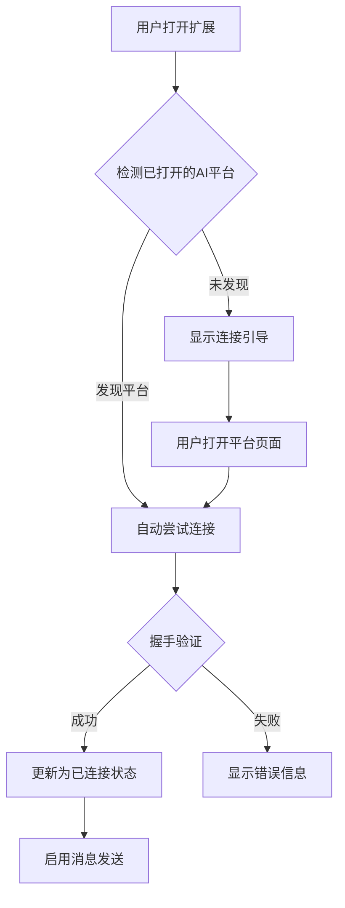
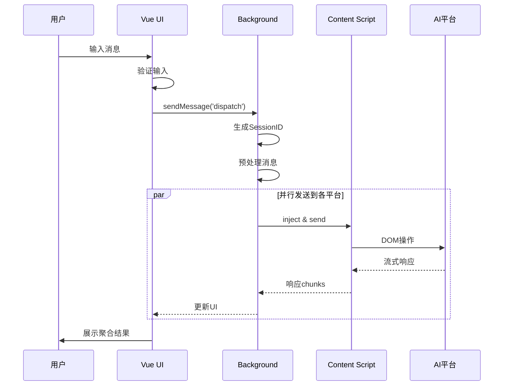

# OmniChat 产品开发文档 (PRD) - v3
| **文档版本** | **日期** | **作者** | **状态** | **修订说明** |
| :--- | :--- | :--- | :--- | :--- |
| 4.0 | 2025年8月27日 | Product Team | 最终版 | 综合优化版本，融合技术架构与产品需求 |

---

## 执行摘要 (Executive Summary)

OmniChat 是一个基于 WXT 框架开发的浏览器扩展，旨在为 AI 重度用户提供统一的多平台交互工作台。通过单次输入，同时向多个 AI 平台（ChatGPT、Claude、Gemini 等）发送请求，并在统一界面中聚合、对比所有响应结果，极大提升工作效率和决策质量。

### 核心价值
- **效率提升 80%**：将 N 次操作简化为 1 次
- **质量优化**：通过多维度对比获得最优答案
- **成本控制**：避免单一平台依赖，选择最适合的服务

---

## 1. 产品概述 (Product Overview)

### 1.1 产品定位 (Product Positioning)

**一句话描述**：AI 时代的瑞士军刀 - 一个输入，多个答案，最优选择。

**产品类型**：生产力工具 / 浏览器扩展

**技术栈**：WXT + Vue 3 + TypeScript + @webext-core

### 1.2 目标用户画像 (User Personas)

#### 主要用户群体

| 用户类型 | 使用场景 | 核心诉求 | 日常痛点 |
|---------|---------|---------|---------|
| **开发工程师** | 代码调试、架构设计、技术选型 | 获得多角度技术方案 | 单一 AI 的代码质量参差不齐 |
| **内容创作者** | 文案创作、创意策划、内容优化 | 多样化的创意灵感 | 在多个平台间复制粘贴耗时 |
| **产品经理** | 需求分析、竞品研究、PRD 撰写 | 全面的信息收集 | 难以快速对比不同 AI 的分析结果 |
| **研究分析师** | 数据分析、市场调研、报告撰写 | 交叉验证信息准确性 | 需要手动整合多源信息 |
| **AI 爱好者** | 模型测试、能力评估、学习研究 | 系统性对比模型差异 | 缺乏统一的测试环境 |

### 1.3 核心问题与解决方案 (Problem & Solution)

| 用户痛点 | 现状描述 | OmniChat 解决方案 | 预期效果 |
|---------|---------|------------------|---------|
| **重复操作** | 同一问题需在 5+ 个平台重复输入 | 一键广播到所有平台 | 节省 80% 操作时间 |
| **对比困难** | 切换标签页对比，容易遗漏信息 | 并排展示所有响应 | 提升 60% 对比效率 |
| **上下文丢失** | 各平台对话独立，无法共享上下文 | 统一会话管理 | 保持 100% 上下文一致性 |
| **文件处理** | 部分平台支持文件，需分别上传 | 统一文件分发 | 一次上传，多平台共享 |
| **状态混乱** | 不清楚哪些平台已响应 | 实时状态追踪 | 清晰展示每个平台状态 |

### 1.4 产品目标与成功指标 (Goals & KPIs)

#### 短期目标（3个月）
- **用户增长**：DAU 达到 1,000+
- **功能完成**：支持 5+ 主流 AI 平台
- **用户满意**：Chrome Store 评分 > 4.5 星
- **技术稳定**：崩溃率 < 0.1%

#### 中期目标（6个月）
- **用户增长**：DAU 达到 10,000+
- **功能深化**：支持高级功能（模板、批处理等）
- **社区建设**：活跃社区用户 1,000+
- **商业探索**：Pro 版本付费转化率 > 5%

#### 长期愿景（12个月）
- **市场地位**：成为 AI 工具聚合类第一品牌
- **生态建设**：开放 API，支持第三方集成
- **全球化**：支持 10+ 语言版本

---

## 2. 功能需求详述 (Detailed Functional Requirements)

### 2.1 核心功能矩阵

| 功能模块 | 功能点 | 优先级 | 技术复杂度 | 用户价值 | Sprint |
|---------|-------|--------|-----------|---------|--------|
| **连接管理** | 平台发现与连接 | P0 | 中 | 高 | Sprint 1 |
| | 连接状态监控 | P0 | 低 | 高 | Sprint 1 |
| | 自动重连机制 | P1 | 中 | 中 | Sprint 2 |
| **消息系统** | 统一输入广播 | P0 | 高 | 高 | Sprint 1 |
| | 会话 ID 管理 | P0 | 中 | 高 | Sprint 1 |
| | 流式响应处理 | P0 | 高 | 高 | Sprint 1 |
| **响应聚合** | 多列卡片布局 | P0 | 低 | 高 | Sprint 1 |
| | 响应内容渲染 | P0 | 中 | 高 | Sprint 1 |
| | 对比视图模式 | P1 | 中 | 中 | Sprint 2 |
| **操作控制** | 单平台取消 | P0 | 中 | 高 | Sprint 1 |
| | 全局取消 | P0 | 低 | 高 | Sprint 1 |
| | 重试机制 | P1 | 中 | 中 | Sprint 2 |
| **文件处理** | 文件上传 | P1 | 高 | 中 | Sprint 3 |
| | 多平台分发 | P1 | 高 | 中 | Sprint 3 |
| **数据管理** | 会话历史 | P1 | 中 | 高 | Sprint 2 |
| | 数据导出 | P2 | 低 | 低 | Sprint 3 |

### 2.2 功能详细设计

#### FR-01: 智能连接管理系统

##### 2.2.1 功能描述
提供智能的平台连接管理，自动发现已打开的 AI 平台标签页，建立稳定的双向通信通道。

##### 2.2.2 用户流程


##### 2.2.3 技术实现

```typescript
// 连接握手协议
interface HandshakeProtocol {
  // Phase 1: 发现
  discover: {
    request: { type: 'PING', timestamp: number };
    response: { type: 'PONG', platformId: string, capabilities: PlatformCapabilities };
  };

  // Phase 2: 验证
  verify: {
    request: { type: 'VERIFY', token: string };
    response: { type: 'VERIFIED', sessionToken: string };
  };

  // Phase 3: 心跳
  heartbeat: {
    request: { type: 'HEARTBEAT' };
    response: { type: 'HEARTBEAT_ACK', status: 'healthy' | 'degraded' };
  };
}

// 平台能力声明
interface PlatformCapabilities {
  supportsStreaming: boolean;
  supportsFiles: boolean;
  supportedFileTypes: string[];
  maxFileSize: number;
  supportsMarkdown: boolean;
  supportsCode: boolean;
  hasRateLimit: boolean;
  rateLimitInfo?: {
    requests: number;
    window: number; // 秒
  };
}
```

##### 2.2.4 状态机设计

```typescript
enum ConnectionState {
  DISCONNECTED = 'disconnected',     // 初始状态
  DISCOVERING = 'discovering',       // 正在发现
  CONNECTING = 'connecting',         // 正在连接
  VERIFYING = 'verifying',          // 正在验证
  CONNECTED = 'connected',           // 已连接
  DEGRADED = 'degraded',            // 连接降级
  ERROR = 'error',                  // 连接错误
  RECONNECTING = 'reconnecting'     // 重连中
}

// 状态转换规则
const stateTransitions = {
  [ConnectionState.DISCONNECTED]: [ConnectionState.DISCOVERING],
  [ConnectionState.DISCOVERING]: [ConnectionState.CONNECTING, ConnectionState.ERROR],
  [ConnectionState.CONNECTING]: [ConnectionState.VERIFYING, ConnectionState.ERROR],
  [ConnectionState.VERIFYING]: [ConnectionState.CONNECTED, ConnectionState.ERROR],
  [ConnectionState.CONNECTED]: [ConnectionState.DEGRADED, ConnectionState.DISCONNECTED],
  [ConnectionState.DEGRADED]: [ConnectionState.RECONNECTING, ConnectionState.DISCONNECTED],
  [ConnectionState.RECONNECTING]: [ConnectionState.CONNECTED, ConnectionState.ERROR],
  [ConnectionState.ERROR]: [ConnectionState.DISCOVERING]
};
```

#### FR-02: 高性能消息分发系统

##### 2.2.1 功能描述
实现高效的消息分发机制，支持并发发送、流式响应、智能重试。

##### 2.2.2 架构设计

```typescript
// 消息分发器核心
class MessageDispatcher {
  private queue: PriorityQueue<Message>;
  private workers: Map<PlatformId, Worker>;
  private rateLimiters: Map<PlatformId, RateLimiter>;

  async dispatch(message: UserMessage): Promise<DispatchResult> {
    // 1. 生成会话ID
    const sessionId = generateSessionId();

    // 2. 消息预处理
    const processed = await this.preprocessMessage(message);

    // 3. 分发策略选择
    const strategy = this.selectStrategy(processed);

    // 4. 执行分发
    return await this.executeDispatch(sessionId, processed, strategy);
  }

  private selectStrategy(message: ProcessedMessage): DispatchStrategy {
    // 根据消息特征选择最优策略
    if (message.hasFiles) {
      return new FileAwareStrategy();
    } else if (message.priority === 'high') {
      return new PriorityStrategy();
    } else if (this.hasRateLimitedPlatforms()) {
      return new ThrottledStrategy();
    } else {
      return new ParallelStrategy();
    }
  }
}

// 分发策略接口
interface DispatchStrategy {
  execute(
    sessionId: string,
    message: ProcessedMessage,
    platforms: Platform[]
  ): Promise<DispatchResult>;
}

// 并行策略：同时发送到所有平台
class ParallelStrategy implements DispatchStrategy {
  async execute(sessionId: string, message: ProcessedMessage, platforms: Platform[]) {
    const promises = platforms.map(platform =>
      this.sendToPlatform(sessionId, message, platform)
    );

    return Promise.allSettled(promises);
  }
}

// 限流策略：根据各平台限制智能调度
class ThrottledStrategy implements DispatchStrategy {
  async execute(sessionId: string, message: ProcessedMessage, platforms: Platform[]) {
    const scheduler = new AdaptiveScheduler();

    for (const platform of platforms) {
      await scheduler.schedule(platform, () =>
        this.sendToPlatform(sessionId, message, platform)
      );
    }
  }
}
```

##### 2.2.3 流式响应处理

```typescript
// 流式响应处理器
class StreamProcessor {
  private buffers: Map<string, ResponseBuffer>;
  private decoders: Map<PlatformId, StreamDecoder>;

  async processStream(
    platformId: PlatformId,
    stream: ReadableStream<Uint8Array>
  ): AsyncGenerator<ResponseChunk> {
    const decoder = this.getDecoder(platformId);
    const reader = stream.getReader();

    try {
      while (true) {
        const { done, value } = await reader.read();

        if (done) break;

        // 解码并处理chunk
        const decoded = decoder.decode(value);
        const chunks = this.parseChunks(decoded);

        for (const chunk of chunks) {
          // 智能缓冲，避免过于频繁的UI更新
          const buffered = await this.smartBuffer(platformId, chunk);

          if (buffered) {
            yield buffered;
          }
        }
      }
    } finally {
      reader.releaseLock();
    }
  }

  private smartBuffer(platformId: PlatformId, chunk: ResponseChunk): ResponseChunk | null {
    const buffer = this.buffers.get(platformId);

    // 智能缓冲策略
    if (chunk.isCodeBlock || chunk.isMarkdown) {
      // 代码块和Markdown需要完整性，延迟输出
      buffer.accumulate(chunk);

      if (buffer.isComplete()) {
        return buffer.flush();
      }

      return null;
    } else {
      // 普通文本立即输出
      return chunk;
    }
  }
}
```

#### FR-03: 智能 UI 自适应系统

##### 2.3.1 功能描述
根据活跃平台数量和屏幕尺寸，智能调整UI布局，确保最佳的信息展示密度。

##### 2.3.2 自适应算法

```typescript
class AdaptiveUIController {
  private readonly breakpoints = {
    mobile: 768,
    tablet: 1024,
    desktop: 1440,
    wide: 1920
  };

  calculateOptimalLayout(params: {
    screenWidth: number;
    screenHeight: number;
    activePlatforms: number;
    userPreference: ViewMode;
  }): LayoutConfiguration {
    const { screenWidth, activePlatforms, userPreference } = params;

    // 1. 确定设备类型
    const deviceType = this.getDeviceType(screenWidth);

    // 2. 计算信息密度
    const density = this.calculateDensity(activePlatforms, screenWidth);

    // 3. 选择布局模式
    let layoutMode: LayoutMode;

    if (userPreference === 'auto') {
      if (density > 0.8) {
        layoutMode = 'compact';
      } else if (density > 0.5) {
        layoutMode = 'comfortable';
      } else {
        layoutMode = 'spacious';
      }
    } else {
      layoutMode = userPreference;
    }

    // 4. 生成布局配置
    return this.generateLayout(deviceType, layoutMode, activePlatforms);
  }

  private generateLayout(
    device: DeviceType,
    mode: LayoutMode,
    platforms: number
  ): LayoutConfiguration {
    const config: LayoutConfiguration = {
      columns: 1,
      cardSize: 'large',
      showFullContent: true,
      enableAnimations: true,
      enableVirtualScroll: false
    };

    // 响应式列数计算
    if (device === 'wide' && platforms <= 6) {
      config.columns = Math.min(platforms, 3);
    } else if (device === 'desktop' && platforms <= 4) {
      config.columns = Math.min(platforms, 2);
    } else if (device === 'tablet' && platforms <= 2) {
      config.columns = 2;
    }

    // 内容显示策略
    if (platforms > 4) {
      config.showFullContent = false; // 显示摘要
      config.cardSize = 'medium';
    }

    if (platforms > 6) {
      config.enableVirtualScroll = true; // 启用虚拟滚动
      config.cardSize = 'small';
      config.enableAnimations = false; // 关闭动画以提升性能
    }

    return config;
  }
}
```

---

## 3. 技术架构设计 (Technical Architecture)

### 3.1 系统架构图

```
┌─────────────────────────────────────────────────────────────┐
│                         用户界面层                           │
│  ┌──────────────────────────────────────────────────────┐  │
│  │           Vue 3 + Pinia + Tailwind CSS               │  │
│  │  ┌──────────┐  ┌──────────┐  ┌──────────────────┐  │  │
│  │  │  Popup   │  │ Options  │  │  OmniChat Page   │  │  │
│  │  └──────────┘  └──────────┘  └──────────────────┘  │  │
│  └──────────────────────────────────────────────────────┘  │
└─────────────────────────────────────────────────────────────┘
                              ↕
┌─────────────────────────────────────────────────────────────┐
│                     消息通信层                               │
│  ┌──────────────────────────────────────────────────────┐  │
│  │         @webext-core/messaging Protocol              │  │
│  │    类型安全 · 双向通信 · 自动序列化 · 错误处理          │  │
│  └──────────────────────────────────────────────────────┘  │
└─────────────────────────────────────────────────────────────┘
                              ↕
┌─────────────────────────────────────────────────────────────┐
│                    业务逻辑层                               │
│  ┌──────────────────────────────────────────────────────┐  │
│  │              Background Service Worker               │  │
│  │  ┌────────────┐  ┌────────────┐  ┌──────────────┐  │  │
│  │  │ Connection │  │  Message   │  │   Session    │  │  │
│  │  │  Manager   │  │ Dispatcher │  │   Manager    │  │  │
│  │  └────────────┘  └────────────┘  └──────────────┘  │  │
│  └──────────────────────────────────────────────────────┘  │
└─────────────────────────────────────────────────────────────┘
                              ↕
┌─────────────────────────────────────────────────────────────┐
│                    平台适配层                               │
│  ┌──────────────────────────────────────────────────────┐  │
│  │               Content Scripts                        │  │
│  │  ┌──────────┐  ┌──────────┐  ┌──────────────────┐  │  │
│  │  │ ChatGPT  │  │  Claude  │  │     Gemini       │  │  │
│  │  │ Adapter  │  │ Adapter  │  │    Adapter       │  │  │
│  │  └──────────┘  └──────────┘  └──────────────────┘  │  │
│  └──────────────────────────────────────────────────────┘  │
└─────────────────────────────────────────────────────────────┘
                              ↕
┌─────────────────────────────────────────────────────────────┐
│                    数据持久化层                             │
│  ┌──────────────────────────────────────────────────────┐  │
│  │           @webext-core/storage                       │  │
│  │  ┌──────────┐  ┌──────────┐  ┌──────────────────┐  │  │
│  │  │  Config  │  │ Sessions │  │   Statistics     │  │  │
│  │  └──────────┘  └──────────┘  └──────────────────┘  │  │
│  └──────────────────────────────────────────────────────┘  │
└─────────────────────────────────────────────────────────────┘
```

### 3.2 核心模块职责

| 模块 | 职责 | 关键类/接口 | 依赖关系 |
|------|------|------------|----------|
| **UI层** | 用户交互、状态展示 | App.vue, WorkspaceView | Pinia Store |
| **消息层** | 跨组件通信 | ProtocolMap, MessageBus | - |
| **业务层** | 核心业务逻辑 | ConnectionManager, Dispatcher | Storage |
| **适配层** | 平台特定实现 | PlatformAdapter | DOM API |
| **存储层** | 数据持久化 | StorageManager | IndexedDB |

### 3.3 数据流设计



---

## 4. 平台适配策略 (Platform Adaptation)

### 4.1 适配器模式设计

```typescript
// 基础适配器抽象
abstract class BasePlatformAdapter {
  protected readonly platformId: PlatformId;
  protected readonly selectors: PlatformSelectors;
  protected readonly config: AdapterConfig;

  // 生命周期钩子
  abstract async onConnect(): Promise<void>;
  abstract async onDisconnect(): Promise<void>;
  abstract async onMessage(message: Message): Promise<void>;

  // 核心功能
  abstract async sendMessage(content: string, options?: SendOptions): Promise<void>;
  abstract async attachFiles(files: File[]): Promise<void>;
  abstract async cancelGeneration(): Promise<void>;

  // DOM 操作辅助方法
  protected async waitForElement(selector: string, timeout?: number): Promise<Element>;
  protected async simulateTyping(element: Element, text: string): Promise<void>;
  protected watchForResponse(callback: ResponseCallback): void;

  // 错误恢复
  protected async handleError(error: Error): Promise<void> {
    if (error instanceof SelectorNotFoundError) {
      await this.attemptSelectorRecovery();
    } else if (error instanceof RateLimitError) {
      await this.handleRateLimit();
    } else {
      throw error;
    }
  }
}
```

### 4.2 平台配置管理

```yaml
# platform-configs/chatgpt.yaml
platform:
  id: chatgpt
  name: ChatGPT
  url: https://chat.openai.com
  icon: /assets/icons/chatgpt.svg

selectors:
  v1: # 当前版本
    input: "#prompt-textarea"
    send: "[data-testid='send-button']"
    response: "[data-message-author-role='assistant']"
    cancel: "button[aria-label='Stop generating']"

  v0: # 旧版本备份
    input: "textarea.m-0"
    send: "button.absolute"

features:
  streaming: true
  files: true
  markdown: true
  codeHighlight: true
  maxTokens: 4096

rateLimit:
  requests: 50
  window: 180 # 3 hours
```

### 4.3 选择器自愈机制

```typescript
class SelectorHealer {
  private readonly strategies = [
    new TextContentStrategy(),      // 通过文本内容查找
    new AriaLabelStrategy(),       // 通过ARIA标签查找
    new ClassPatternStrategy(),    // 通过类名模式查找
    new StructuralStrategy(),      // 通过DOM结构查找
    new MLPredictionStrategy()     // 机器学习预测
  ];

  async heal(
    platform: PlatformId,
    elementType: ElementType,
    context: DOMContext
  ): Promise<string> {
    // 1. 获取历史成功的选择器
    const history = await this.getHistoricalSelectors(platform, elementType);

    // 2. 尝试各种策略
    for (const strategy of this.strategies) {
      try {
        const selector = await strategy.findSelector(elementType, context, history);

        if (await this.validate(selector)) {
          // 3. 更新配置
          await this.updateConfig(platform, elementType, selector);

          // 4. 上报成功
          await this.reportSuccess(platform, elementType, selector);

          return selector;
        }
      } catch (e) {
        continue;
      }
    }

    throw new SelectorHealingFailedError(platform, elementType);
  }
}
```

---

## 5. 性能优化方案 (Performance Optimization)

### 5.1 性能指标体系

| 指标类别 | 具体指标 | 目标值 | 测量方法 | 优化策略 |
|---------|---------|-------|---------|----------|
| **加载性能** | 扩展初始化时间 | < 100ms | Performance API | 代码分割、懒加载 |
| | 首屏渲染时间 | < 200ms | FCP | 关键路径优化 |
| **运行性能** | 消息发送延迟 | < 50ms | 自定义埋点 | 消息队列优化 |
| | 响应渲染延迟 | < 16ms | RAF | 虚拟滚动、防抖 |
| | 内存占用 | < 50MB | Memory API | 对象池、弱引用 |
| **网络性能** | 并发连接数 | 优化到最小 | DevTools | 连接复用 |
| | 消息体积 | 压缩 30% | 自定义 | 消息压缩 |

### 5.2 优化实施方案

```typescript
// 1. 虚拟滚动实现
class VirtualScroller {
  private itemHeight = 120;
  private buffer = 3;
  private scrollTop = 0;

  calculateVisibleRange(
    containerHeight: number,
    totalItems: number
  ): { start: number; end: number } {
    const visibleCount = Math.ceil(containerHeight / this.itemHeight);
    const start = Math.floor(this.scrollTop / this.itemHeight);
    const end = Math.min(start + visibleCount + this.buffer, totalItems);

    return {
      start: Math.max(0, start - this.buffer),
      end
    };
  }
}

// 2. 消息批处理
class MessageBatcher {
  private batch: Message[] = [];
  private timer: NodeJS.Timeout;
  private readonly batchSize = 10;
  private readonly batchDelay = 50;

  add(message: Message): Promise<void> {
    return new Promise((resolve) => {
      this.batch.push({ ...message, resolve });

      if (this.batch.length >= this.batchSize) {
        this.flush();
      } else {
        this.scheduledFlush();
      }
    });
  }

  private flush() {
    const messages = this.batch.splice(0
