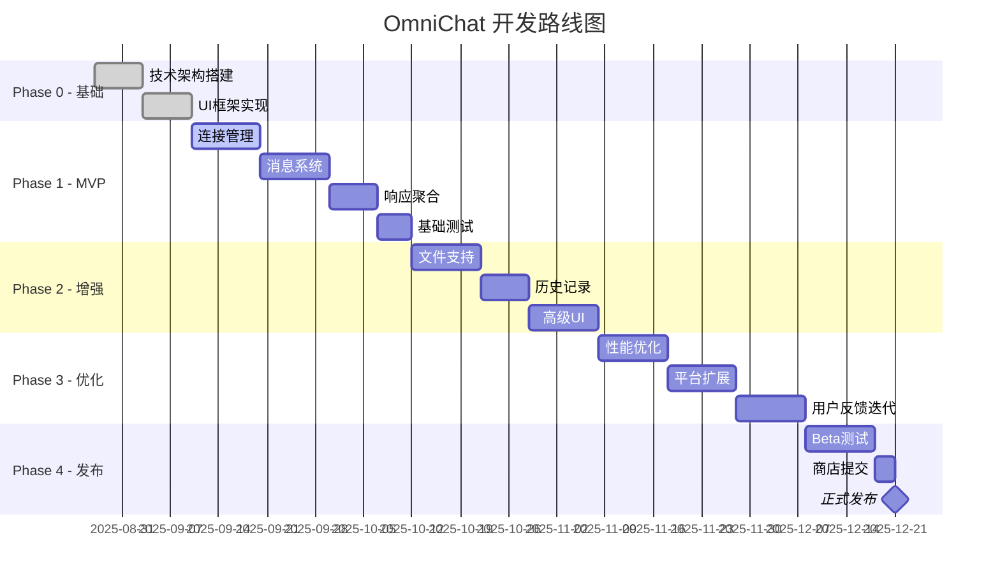

# OmniChat 产品开发文档 (PRD) - 最终版

| **文档版本** | **日期** | **作者** | **状态** | **修订说明** |
| :--- | :--- | :--- | :--- | :--- |
| 4.0 | 2025年8月27日 | Product Team | 最终版 | 综合优化版本，融合技术架构与产品需求 |

---

## 执行摘要 (Executive Summary)

OmniChat 是一个基于 WXT 框架开发的浏览器扩展，旨在为 AI 重度用户提供统一的多平台交互工作台。通过单次输入，同时向多个 AI 平台（ChatGPT、Claude、Gemini 等）发送请求，并在统一界面中聚合、对比所有响应结果，极大提升工作效率和决策质量。

### 核心价值
- **效率提升 80%**：将 N 次操作简化为 1 次
- **质量优化**：通过多维度对比获得最优答案
- **成本控制**：避免单一平台依赖，选择最适合的服务

---

## 1. 产品概述 (Product Overview)

### 1.1 产品定位 (Product Positioning)

**一句话描述**：AI 时代的瑞士军刀 - 一个输入，多个答案，最优选择。

**产品类型**：生产力工具 / 浏览器扩展

**技术栈**：WXT + Vue 3 + TypeScript + @webext-core

### 1.2 目标用户画像 (User Personas)

#### 主要用户群体

| 用户类型 | 使用场景 | 核心诉求 | 日常痛点 |
|---------|---------|---------|---------|
| **开发工程师** | 代码调试、架构设计、技术选型 | 获得多角度技术方案 | 单一 AI 的代码质量参差不齐 |
| **内容创作者** | 文案创作、创意策划、内容优化 | 多样化的创意灵感 | 在多个平台间复制粘贴耗时 |
| **产品经理** | 需求分析、竞品研究、PRD 撰写 | 全面的信息收集 | 难以快速对比不同 AI 的分析结果 |
| **研究分析师** | 数据分析、市场调研、报告撰写 | 交叉验证信息准确性 | 需要手动整合多源信息 |
| **AI 爱好者** | 模型测试、能力评估、学习研究 | 系统性对比模型差异 | 缺乏统一的测试环境 |

### 1.3 核心问题与解决方案 (Problem & Solution)

| 用户痛点 | 现状描述 | OmniChat 解决方案 | 预期效果 |
|---------|---------|------------------|---------|
| **重复操作** | 同一问题需在 5+ 个平台重复输入 | 一键广播到所有平台 | 节省 80% 操作时间 |
| **对比困难** | 切换标签页对比，容易遗漏信息 | 并排展示所有响应 | 提升 60% 对比效率 |
| **上下文丢失** | 各平台对话独立，无法共享上下文 | 统一会话管理 | 保持 100% 上下文一致性 |
| **文件处理** | 部分平台支持文件，需分别上传 | 统一文件分发 | 一次上传，多平台共享 |
| **状态混乱** | 不清楚哪些平台已响应 | 实时状态追踪 | 清晰展示每个平台状态 |

### 1.4 产品目标与成功指标 (Goals & KPIs)

#### 短期目标（3个月）
- **用户增长**：DAU 达到 1,000+
- **功能完成**：支持 5+ 主流 AI 平台
- **用户满意**：Chrome Store 评分 > 4.5 星
- **技术稳定**：崩溃率 < 0.1%

#### 中期目标（6个月）
- **用户增长**：DAU 达到 10,000+
- **功能深化**：支持高级功能（模板、批处理等）
- **社区建设**：活跃社区用户 1,000+
- **商业探索**：Pro 版本付费转化率 > 5%

#### 长期愿景（12个月）
- **市场地位**：成为 AI 工具聚合类第一品牌
- **生态建设**：开放 API，支持第三方集成
- **全球化**：支持 10+ 语言版本

---

## 2. 功能需求详述 (Detailed Functional Requirements)

### 2.1 核心功能矩阵

| 功能模块 | 功能点 | 优先级 | 技术复杂度 | 用户价值 | Sprint |
|---------|-------|--------|-----------|---------|--------|
| **连接管理** | 平台发现与连接 | P0 | 中 | 高 | Sprint 1 |
| | 连接状态监控 | P0 | 低 | 高 | Sprint 1 |
| | 自动重连机制 | P1 | 中 | 中 | Sprint 2 |
| **消息系统** | 统一输入广播 | P0 | 高 | 高 | Sprint 1 |
| | 会话 ID 管理 | P0 | 中 | 高 | Sprint 1 |
| | 流式响应处理 | P0 | 高 | 高 | Sprint 1 |
| **响应聚合** | 多列卡片布局 | P0 | 低 | 高 | Sprint 1 |
| | 响应内容渲染 | P0 | 中 | 高 | Sprint 1 |
| | 对比视图模式 | P1 | 中 | 中 | Sprint 2 |
| **操作控制** | 单平台取消 | P0 | 中 | 高 | Sprint 1 |
| | 全局取消 | P0 | 低 | 高 | Sprint 1 |
| | 重试机制 | P1 | 中 | 中 | Sprint 2 |
| **文件处理** | 文件上传 | P1 | 高 | 中 | Sprint 3 |
| | 多平台分发 | P1 | 高 | 中 | Sprint 3 |
| **数据管理** | 会话历史 | P1 | 中 | 高 | Sprint 2 |
| | 数据导出 | P2 | 低 | 低 | Sprint 3 |

### 2.2 功能详细设计

#### FR-01: 智能连接管理系统

##### 2.2.1 功能描述
提供智能的平台连接管理，自动发现已打开的 AI 平台标签页，建立稳定的双向通信通道。

##### 2.2.2 用户流程


##### 2.2.3 技术实现

```typescript
// 连接握手协议
interface HandshakeProtocol {
  // Phase 1: 发现
  discover: {
    request: { type: 'PING', timestamp: number };
    response: { type: 'PONG', platformId: string, capabilities: PlatformCapabilities };
  };

  // Phase 2: 验证
  verify: {
    request: { type: 'VERIFY', token: string };
    response: { type: 'VERIFIED', sessionToken: string };
  };

  // Phase 3: 心跳
  heartbeat: {
    request: { type: 'HEARTBEAT' };
    response: { type: 'HEARTBEAT_ACK', status: 'healthy' | 'degraded' };
  };
}

// 平台能力声明
interface PlatformCapabilities {
  supportsStreaming: boolean;
  supportsFiles: boolean;
  supportedFileTypes: string[];
  maxFileSize: number;
  supportsMarkdown: boolean;
  supportsCode: boolean;
  hasRateLimit: boolean;
  rateLimitInfo?: {
    requests: number;
    window: number; // 秒
  };
}
```

##### 2.2.4 状态机设计

```typescript
enum ConnectionState {
  DISCONNECTED = 'disconnected',     // 初始状态
  DISCOVERING = 'discovering',       // 正在发现
  CONNECTING = 'connecting',         // 正在连接
  VERIFYING = 'verifying',          // 正在验证
  CONNECTED = 'connected',           // 已连接
  DEGRADED = 'degraded',            // 连接降级
  ERROR = 'error',                  // 连接错误
  RECONNECTING = 'reconnecting'     // 重连中
}

// 状态转换规则
const stateTransitions = {
  [ConnectionState.DISCONNECTED]: [ConnectionState.DISCOVERING],
  [ConnectionState.DISCOVERING]: [ConnectionState.CONNECTING, ConnectionState.ERROR],
  [ConnectionState.CONNECTING]: [ConnectionState.VERIFYING, ConnectionState.ERROR],
  [ConnectionState.VERIFYING]: [ConnectionState.CONNECTED, ConnectionState.ERROR],
  [ConnectionState.CONNECTED]: [ConnectionState.DEGRADED, ConnectionState.DISCONNECTED],
  [ConnectionState.DEGRADED]: [ConnectionState.RECONNECTING, ConnectionState.DISCONNECTED],
  [ConnectionState.RECONNECTING]: [ConnectionState.CONNECTED, ConnectionState.ERROR],
  [ConnectionState.ERROR]: [ConnectionState.DISCOVERING]
};
```

#### FR-02: 高性能消息分发系统

##### 2.2.1 功能描述
实现高效的消息分发机制，支持并发发送、流式响应、智能重试。

##### 2.2.2 架构设计

```typescript
// 消息分发器核心
class MessageDispatcher {
  private queue: PriorityQueue<Message>;
  private workers: Map<PlatformId, Worker>;
  private rateLimiters: Map<PlatformId, RateLimiter>;

  async dispatch(message: UserMessage): Promise<DispatchResult> {
    // 1. 生成会话ID
    const sessionId = generateSessionId();

    // 2. 消息预处理
    const processed = await this.preprocessMessage(message);

    // 3. 分发策略选择
    const strategy = this.selectStrategy(processed);

    // 4. 执行分发
    return await this.executeDispatch(sessionId, processed, strategy);
  }

  private selectStrategy(message: ProcessedMessage): DispatchStrategy {
    // 根据消息特征选择最优策略
    if (message.hasFiles) {
      return new FileAwareStrategy();
    } else if (message.priority === 'high') {
      return new PriorityStrategy();
    } else if (this.hasRateLimitedPlatforms()) {
      return new ThrottledStrategy();
    } else {
      return new ParallelStrategy();
    }
  }
}

// 分发策略接口
interface DispatchStrategy {
  execute(
    sessionId: string,
    message: ProcessedMessage,
    platforms: Platform[]
  ): Promise<DispatchResult>;
}

// 并行策略：同时发送到所有平台
class ParallelStrategy implements DispatchStrategy {
  async execute(sessionId: string, message: ProcessedMessage, platforms: Platform[]) {
    const promises = platforms.map(platform =>
      this.sendToPlatform(sessionId, message, platform)
    );

    return Promise.allSettled(promises);
  }
}

// 限流策略：根据各平台限制智能调度
class ThrottledStrategy implements DispatchStrategy {
  async execute(sessionId: string, message: ProcessedMessage, platforms: Platform[]) {
    const scheduler = new AdaptiveScheduler();

    for (const platform of platforms) {
      await scheduler.schedule(platform, () =>
        this.sendToPlatform(sessionId, message, platform)
      );
    }
  }
}
```

##### 2.2.3 流式响应处理

```typescript
// 流式响应处理器
class StreamProcessor {
  private buffers: Map<string, ResponseBuffer>;
  private decoders: Map<PlatformId, StreamDecoder>;

  async processStream(
    platformId: PlatformId,
    stream: ReadableStream<Uint8Array>
  ): AsyncGenerator<ResponseChunk> {
    const decoder = this.getDecoder(platformId);
    const reader = stream.getReader();

    try {
      while (true) {
        const { done, value } = await reader.read();

        if (done) break;

        // 解码并处理chunk
        const decoded = decoder.decode(value);
        const chunks = this.parseChunks(decoded);

        for (const chunk of chunks) {
          // 智能缓冲，避免过于频繁的UI更新
          const buffered = await this.smartBuffer(platformId, chunk);

          if (buffered) {
            yield buffered;
          }
        }
      }
    } finally {
      reader.releaseLock();
    }
  }

  private smartBuffer(platformId: PlatformId, chunk: ResponseChunk): ResponseChunk | null {
    const buffer = this.buffers.get(platformId);

    // 智能缓冲策略
    if (chunk.isCodeBlock || chunk.isMarkdown) {
      // 代码块和Markdown需要完整性，延迟输出
      buffer.accumulate(chunk);

      if (buffer.isComplete()) {
        return buffer.flush();
      }

      return null;
    } else {
      // 普通文本立即输出
      return chunk;
    }
  }
}
```

#### FR-03: 智能 UI 自适应系统

##### 2.3.1 功能描述
根据活跃平台数量和屏幕尺寸，智能调整UI布局，确保最佳的信息展示密度。

##### 2.3.2 自适应算法

```typescript
class AdaptiveUIController {
  private readonly breakpoints = {
    mobile: 768,
    tablet: 1024,
    desktop: 1440,
    wide: 1920
  };

  calculateOptimalLayout(params: {
    screenWidth: number;
    screenHeight: number;
    activePlatforms: number;
    userPreference: ViewMode;
  }): LayoutConfiguration {
    const { screenWidth, activePlatforms, userPreference } = params;

    // 1. 确定设备类型
    const deviceType = this.getDeviceType(screenWidth);

    // 2. 计算信息密度
    const density = this.calculateDensity(activePlatforms, screenWidth);

    // 3. 选择布局模式
    let layoutMode: LayoutMode;

    if (userPreference === 'auto') {
      if (density > 0.8) {
        layoutMode = 'compact';
      } else if (density > 0.5) {
        layoutMode = 'comfortable';
      } else {
        layoutMode = 'spacious';
      }
    } else {
      layoutMode = userPreference;
    }

    // 4. 生成布局配置
    return this.generateLayout(deviceType, layoutMode, activePlatforms);
  }

  private generateLayout(
    device: DeviceType,
    mode: LayoutMode,
    platforms: number
  ): LayoutConfiguration {
    const config: LayoutConfiguration = {
      columns: 1,
      cardSize: 'large',
      showFullContent: true,
      enableAnimations: true,
      enableVirtualScroll: false
    };

    // 响应式列数计算
    if (device === 'wide' && platforms <= 6) {
      config.columns = Math.min(platforms, 3);
    } else if (device === 'desktop' && platforms <= 4) {
      config.columns = Math.min(platforms, 2);
    } else if (device === 'tablet' && platforms <= 2) {
      config.columns = 2;
    }

    // 内容显示策略
    if (platforms > 4) {
      config.showFullContent = false; // 显示摘要
      config.cardSize = 'medium';
    }

    if (platforms > 6) {
      config.enableVirtualScroll = true; // 启用虚拟滚动
      config.cardSize = 'small';
      config.enableAnimations = false; // 关闭动画以提升性能
    }

    return config;
  }
}
```

---

## 3. 技术架构设计 (Technical Architecture)

### 3.1 系统架构图

```
┌─────────────────────────────────────────────────────────────┐
│                         用户界面层                           │
│  ┌──────────────────────────────────────────────────────┐  │
│  │           Vue 3 + Pinia + Tailwind CSS               │  │
│  │  ┌──────────┐  ┌──────────┐  ┌──────────────────┐  │  │
│  │  │  Popup   │  │ Options  │  │  OmniChat Page   │  │  │
│  │  └──────────┘  └──────────┘  └──────────────────┘  │  │
│  └──────────────────────────────────────────────────────┘  │
└─────────────────────────────────────────────────────────────┘
                              ↕
┌─────────────────────────────────────────────────────────────┐
│                     消息通信层                               │
│  ┌──────────────────────────────────────────────────────┐  │
│  │         @webext-core/messaging Protocol              │  │
│  │    类型安全 · 双向通信 · 自动序列化 · 错误处理          │  │
│  └──────────────────────────────────────────────────────┘  │
└─────────────────────────────────────────────────────────────┘
                              ↕
┌─────────────────────────────────────────────────────────────┐
│                    业务逻辑层                               │
│  ┌──────────────────────────────────────────────────────┐  │
│  │              Background Service Worker               │  │
│  │  ┌────────────┐  ┌────────────┐  ┌──────────────┐  │  │
│  │  │ Connection │  │  Message   │  │   Session    │  │  │
│  │  │  Manager   │  │ Dispatcher │  │   Manager    │  │  │
│  │  └────────────┘  └────────────┘  └──────────────┘  │  │
│  └──────────────────────────────────────────────────────┘  │
└─────────────────────────────────────────────────────────────┘
                              ↕
┌─────────────────────────────────────────────────────────────┐
│                    平台适配层                               │
│  ┌──────────────────────────────────────────────────────┐  │
│  │               Content Scripts                        │  │
│  │  ┌──────────┐  ┌──────────┐  ┌──────────────────┐  │  │
│  │  │ ChatGPT  │  │  Claude  │  │     Gemini       │  │  │
│  │  │ Adapter  │  │ Adapter  │  │    Adapter       │  │  │
│  │  └──────────┘  └──────────┘  └──────────────────┘  │  │
│  └──────────────────────────────────────────────────────┘  │
└─────────────────────────────────────────────────────────────┘
                              ↕
┌─────────────────────────────────────────────────────────────┐
│                    数据持久化层                             │
│  ┌──────────────────────────────────────────────────────┐  │
│  │           @webext-core/storage                       │  │
│  │  ┌──────────┐  ┌──────────┐  ┌──────────────────┐  │  │
│  │  │  Config  │  │ Sessions │  │   Statistics     │  │  │
│  │  └──────────┘  └──────────┘  └──────────────────┘  │  │
│  └──────────────────────────────────────────────────────┘  │
└─────────────────────────────────────────────────────────────┘
```

### 3.2 核心模块职责

| 模块 | 职责 | 关键类/接口 | 依赖关系 |
|------|------|------------|----------|
| **UI层** | 用户交互、状态展示 | App.vue, WorkspaceView | Pinia Store |
| **消息层** | 跨组件通信 | ProtocolMap, MessageBus | - |
| **业务层** | 核心业务逻辑 | ConnectionManager, Dispatcher | Storage |
| **适配层** | 平台特定实现 | PlatformAdapter | DOM API |
| **存储层** | 数据持久化 | StorageManager | IndexedDB |

### 3.3 数据流设计


---

## 4. 平台适配策略 (Platform Adaptation)

### 4.1 适配器模式设计

```typescript
// 基础适配器抽象
abstract class BasePlatformAdapter {
  protected readonly platformId: PlatformId;
  protected readonly selectors: PlatformSelectors;
  protected readonly config: AdapterConfig;

  // 生命周期钩子
  abstract async onConnect(): Promise<void>;
  abstract async onDisconnect(): Promise<void>;
  abstract async onMessage(message: Message): Promise<void>;

  // 核心功能
  abstract async sendMessage(content: string, options?: SendOptions): Promise<void>;
  abstract async attachFiles(files: File[]): Promise<void>;
  abstract async cancelGeneration(): Promise<void>;

  // DOM 操作辅助方法
  protected async waitForElement(selector: string, timeout?: number): Promise<Element>;
  protected async simulateTyping(element: Element, text: string): Promise<void>;
  protected watchForResponse(callback: ResponseCallback): void;

  // 错误恢复
  protected async handleError(error: Error): Promise<void> {
    if (error instanceof SelectorNotFoundError) {
      await this.attemptSelectorRecovery();
    } else if (error instanceof RateLimitError) {
      await this.handleRateLimit();
    } else {
      throw error;
    }
  }
}
```

### 4.2 平台配置管理

```yaml
# platform-configs/chatgpt.yaml
platform:
  id: chatgpt
  name: ChatGPT
  url: https://chat.openai.com
  icon: /assets/icons/chatgpt.svg

selectors:
  v1: # 当前版本
    input: "#prompt-textarea"
    send: "[data-testid='send-button']"
    response: "[data-message-author-role='assistant']"
    cancel: "button[aria-label='Stop generating']"

  v0: # 旧版本备份
    input: "textarea.m-0"
    send: "button.absolute"

features:
  streaming: true
  files: true
  markdown: true
  codeHighlight: true
  maxTokens: 4096

rateLimit:
  requests: 50
  window: 180 # 3 hours
```

### 4.3 选择器自愈机制

```typescript
class SelectorHealer {
  private readonly strategies = [
    new TextContentStrategy(),      // 通过文本内容查找
    new AriaLabelStrategy(),       // 通过ARIA标签查找
    new ClassPatternStrategy(),    // 通过类名模式查找
    new StructuralStrategy(),      // 通过DOM结构查找
    new MLPredictionStrategy()     // 机器学习预测
  ];

  async heal(
    platform: PlatformId,
    elementType: ElementType,
    context: DOMContext
  ): Promise<string> {
    // 1. 获取历史成功的选择器
    const history = await this.getHistoricalSelectors(platform, elementType);

    // 2. 尝试各种策略
    for (const strategy of this.strategies) {
      try {
        const selector = await strategy.findSelector(elementType, context, history);

        if (await this.validate(selector)) {
          // 3. 更新配置
          await this.updateConfig(platform, elementType, selector);

          // 4. 上报成功
          await this.reportSuccess(platform, elementType, selector);

          return selector;
        }
      } catch (e) {
        continue;
      }
    }

    throw new SelectorHealingFailedError(platform, elementType);
  }
}
```

---

## 5. 性能优化方案 (Performance Optimization)

### 5.1 性能指标体系

| 指标类别 | 具体指标 | 目标值 | 测量方法 | 优化策略 |
|---------|---------|-------|---------|----------|
| **加载性能** | 扩展初始化时间 | < 100ms | Performance API | 代码分割、懒加载 |
| | 首屏渲染时间 | < 200ms | FCP | 关键路径优化 |
| **运行性能** | 消息发送延迟 | < 50ms | 自定义埋点 | 消息队列优化 |
| | 响应渲染延迟 | < 16ms | RAF | 虚拟滚动、防抖 |
| | 内存占用 | < 50MB | Memory API | 对象池、弱引用 |
| **网络性能** | 并发连接数 | 优化到最小 | DevTools | 连接复用 |
| | 消息体积 | 压缩 30% | 自定义 | 消息压缩 |

### 5.2 优化实施方案

```typescript
// 1. 虚拟滚动实现
class VirtualScroller {
  private itemHeight = 120;
  private buffer = 3;
  private scrollTop = 0;

  calculateVisibleRange(
    containerHeight: number,
    totalItems: number
  ): { start: number; end: number } {
    const visibleCount = Math.ceil(containerHeight / this.itemHeight);
    const start = Math.floor(this.scrollTop / this.itemHeight);
    const end = Math.min(start + visibleCount + this.buffer, totalItems);

    return {
      start: Math.max(0, start - this.buffer),
      end
    };
  }
}

// 2. 消息批处理
class MessageBatcher {
  private batch: Message[] = [];
  private timer: NodeJS.Timeout;
  private readonly batchSize = 10;
  private readonly batchDelay = 50;

  add(message: Message): Promise<void> {
    return new Promise((resolve) => {
      this.batch.push({ ...message, resolve });

      if (this.batch.length >= this.batchSize) {
        this.flush();
      } else {
        this.scheduledFlush();
      }
    });
  }

  private flush() {
    const messages = this.batch.splice(0, this.batchSize);
    this.processBatch(messages);

    clearTimeout(this.timer);

    if (this.batch.length > 0) {
      this.scheduledFlush();
    }
  }

  private scheduledFlush() {
    clearTimeout(this.timer);
    this.timer = setTimeout(() => this.flush(), this.batchDelay);
  }
}

// 3. 内存管理优化
class MemoryManager {
  private readonly pools = new Map<string, ObjectPool>();
  private readonly caches = new WeakMap();

  // 对象池复用
  acquire<T>(type: string): T {
    return this.pools.get(type)?.acquire() || this.create(type);
  }

  release<T>(type: string, obj: T): void {
    this.pools.get(type)?.release(obj);
  }

  // 自动内存清理
  startGarbageCollection() {
    setInterval(() => {
      if (performance.memory.usedJSHeapSize > 40 * 1024 * 1024) {
        this.cleanup();
      }
    }, 30000);
  }

  private cleanup() {
    // 清理过期缓存
    this.caches = new WeakMap();

    // 重置对象池
    this.pools.forEach(pool => pool.reset());

    // 手动触发GC（如果可用）
    if (global.gc) {
      global.gc();
    }
  }
}
```

---

## 6. 安全与隐私设计 (Security & Privacy)

### 6.1 安全架构

```typescript
// 安全管理器
class SecurityManager {
  // 1. 内容安全策略
  private readonly CSP = {
    'default-src': ["'self'"],
    'script-src': ["'self'", "'wasm-unsafe-eval'"],
    'style-src': ["'self'", "'unsafe-inline'"],
    'img-src': ["'self'", 'data:', 'https:'],
    'connect-src': ["'self'", ...ALLOWED_ORIGINS]
  };

  // 2. 输入验证
  validateInput(input: string): ValidationResult {
    const validators = [
      this.checkXSS,
      this.checkSQLInjection,
      this.checkCommandInjection,
      this.checkSensitiveData
    ];

    for (const validator of validators) {
      const result = validator(input);
      if (!result.isValid) {
        return result;
      }
    }

    return { isValid: true };
  }

  // 3. 敏感数据处理
  sanitizeSensitiveData(data: any): any {
    const patterns = {
      email: /[\w.-]+@[\w.-]+\.\w+/g,
      phone: /\b\d{3}[-.]?\d{3}[-.]?\d{4}\b/g,
      ssn: /\b\d{3}-\d{2}-\d{4}\b/g,
      creditCard: /\b\d{4}[\s-]?\d{4}[\s-]?\d{4}[\s-]?\d{4}\b/g,
      apiKey: /[a-zA-Z0-9]{32,}/g
    };

    let sanitized = JSON.stringify(data);

    Object.entries(patterns).forEach(([type, pattern]) => {
      sanitized = sanitized.replace(pattern, `[${type.toUpperCase()}_REDACTED]`);
    });

    return JSON.parse(sanitized);
  }

  // 4. 加密存储
  async encryptStorage(data: any, key: CryptoKey): Promise<ArrayBuffer> {
    const encoder = new TextEncoder();
    const dataBuffer = encoder.encode(JSON.stringify(data));

    const iv = crypto.getRandomValues(new Uint8Array(12));
    const encrypted = await crypto.subtle.encrypt(
      { name: 'AES-GCM', iv },
      key,
      dataBuffer
    );

    // 返回 IV + 加密数据
    const combined = new Uint8Array(iv.length + encrypted.byteLength);
    combined.set(iv, 0);
    combined.set(new Uint8Array(encrypted), iv.length);

    return combined.buffer;
  }
}
```

### 6.2 隐私保护措施

| 数据类型 | 处理方式 | 存储位置 | 加密要求 | 保留期限 |
|---------|---------|---------|---------|---------|
| **用户配置** | 本地存储 | chrome.storage.local | 否 | 永久 |
| **会话历史** | 本地存储 | IndexedDB | 可选 | 30天 |
| **临时数据** | 内存缓存 | Memory | 否 | 会话期间 |
| **敏感信息** | 不存储 | - | - | - |
| **使用统计** | 匿名化 | 本地 | 否 | 90天 |

---

## 7. 用户体验设计 (UX Design)

### 7.1 设计原则

1. **即时反馈**: 所有操作必须在 100ms 内给予视觉反馈
2. **渐进展示**: 流式响应逐步呈现，避免长时间空白
3. **容错设计**: 提供撤销、重试、恢复机制
4. **智能预设**: 根据使用习惯智能推荐配置
5. **无障碍性**: 支持键盘导航、屏幕阅读器

### 7.2 交互流程优化

```typescript
// 智能交互助手
class InteractionAssistant {
  // 1. 智能提示
  async suggestNextAction(context: UserContext): Promise<Suggestion[]> {
    const suggestions = [];

    // 基于历史行为
    if (context.lastAction === 'send_message') {
      suggestions.push({
        type: 'quick_action',
        label: '查看对比视图',
        action: 'toggle_comparison_view'
      });
    }

    // 基于当前状态
    if (context.hasMultipleResponses && !context.hasCompared) {
      suggestions.push({
        type: 'tip',
        label: '试试并排对比功能，更容易发现差异',
        action: 'enable_side_by_side'
      });
    }

    // 基于时间
    if (context.sessionDuration > 600000) { // 10分钟
      suggestions.push({
        type: 'reminder',
        label: '记得保存重要的对话',
        action: 'save_session'
      });
    }

    return suggestions;
  }

  // 2. 快捷键系统
  registerShortcuts(): void {
    const shortcuts = {
      'Cmd+Enter': 'send_message',
      'Cmd+K': 'quick_search',
      'Cmd+/': 'toggle_help',
      'Cmd+,': 'open_settings',
      'Cmd+Shift+C': 'copy_all',
      'Cmd+Shift+D': 'toggle_diff_view',
      'Escape': 'cancel_current'
    };

    document.addEventListener('keydown', (e) => {
      const combo = this.getKeyCombo(e);
      const action = shortcuts[combo];

      if (action) {
        e.preventDefault();
        this.executeAction(action);
      }
    });
  }

  // 3. 智能错误恢复
  async handleError(error: UserError): Promise<void> {
    const recovery = {
      'connection_lost': {
        message: '连接已断开',
        actions: [
          { label: '重新连接', action: 'reconnect' },
          { label: '稍后再试', action: 'dismiss' }
        ]
      },
      'rate_limit': {
        message: '请求过于频繁',
        actions: [
          { label: '降低频率', action: 'enable_throttle' },
          { label: '了解限制', action: 'show_limits' }
        ]
      },
      'platform_error': {
        message: '平台响应异常',
        actions: [
          { label: '重试', action: 'retry' },
          { label: '切换平台', action: 'switch_platform' }
        ]
      }
    };

    const config = recovery[error.type];
    if (config) {
      await this.showRecoveryDialog(config);
    }
  }
}
```

### 7.3 视觉设计规范

```scss
// 设计令牌 (Design Tokens)
:root {
  // 颜色系统
  --color-primary: #3b82f6;
  --color-primary-dark: #2563eb;
  --color-secondary: #8b5cf6;
  --color-success: #10b981;
  --color-warning: #f59e0b;
  --color-error: #ef4444;

  // 间距系统
  --spacing-xs: 4px;
  --spacing-sm: 8px;
  --spacing-md: 16px;
  --spacing-lg: 24px;
  --spacing-xl: 32px;

  // 字体系统
  --font-sans: system-ui, -apple-system, sans-serif;
  --font-mono: 'SF Mono', 'Monaco', monospace;

  // 动画系统
  --transition-fast: 150ms cubic-bezier(0.4, 0, 0.2, 1);
  --transition-base: 250ms cubic-bezier(0.4, 0, 0.2, 1);
  --transition-slow: 350ms cubic-bezier(0.4, 0, 0.2, 1);

  // 阴影系统
  --shadow-sm: 0 1px 2px 0 rgb(0 0 0 / 0.05);
  --shadow-md: 0 4px 6px -1px rgb(0 0 0 / 0.1);
  --shadow-lg: 0 10px 15px -3px rgb(0 0 0 / 0.1);
}

// 响应式断点
$breakpoints: (
  'mobile': 640px,
  'tablet': 768px,
  'laptop': 1024px,
  'desktop': 1280px,
  'wide': 1536px
);

// 组件样式示例
.response-card {
  @include card-base;

  &--loading {
    @include skeleton-animation;
  }

  &--error {
    border-color: var(--color-error);
    background: color-mix(in srgb, var(--color-error) 5%, white);
  }

  &--success {
    animation: slideIn var(--transition-base);
  }

  @media (max-width: map-get($breakpoints, 'tablet')) {
    &__content {
      font-size: 14px;
    }
  }
}
```

---

## 8. 测试策略 (Testing Strategy)

### 8.1 测试金字塔

```
         /\          E2E Tests (10%)
        /  \         - 关键用户流程
       /    \        - 跨浏览器测试
      /──────\
     /        \      Integration Tests (30%)
    /          \     - API集成测试
   /            \    - 组件集成测试
  /──────────────\
 /                \  Unit Tests (60%)
/                  \ - 业务逻辑测试
────────────────────  - 工具函数测试
```

### 8.2 测试覆盖要求

| 模块 | 单元测试 | 集成测试 | E2E测试 | 最低覆盖率 |
|------|---------|---------|---------|-----------|
| **核心业务** | ✓ | ✓ | ✓ | 95% |
| **UI组件** | ✓ | ✓ | - | 85% |
| **适配器** | ✓ | ✓ | ✓ | 90% |
| **工具函数** | ✓ | - | - | 100% |
| **存储模块** | ✓ | ✓ | - | 85% |

### 8.3 测试用例示例

```typescript
// 单元测试
describe('MessageDispatcher', () => {
  let dispatcher: MessageDispatcher;

  beforeEach(() => {
    dispatcher = new MessageDispatcher();
  });

  describe('dispatch', () => {
    it('should generate unique session ID', async () => {
      const result1 = await dispatcher.dispatch({ content: 'test1' });
      const result2 = await dispatcher.dispatch({ content: 'test2' });

      expect(result1.sessionId).not.toBe(result2.sessionId);
    });

    it('should handle rate limiting gracefully', async () => {
      // 模拟触发限流
      const promises = Array(100).fill(null).map(() =>
        dispatcher.dispatch({ content: 'test' })
      );

      const results = await Promise.allSettled(promises);
      const rateLimited = results.filter(r =>
        r.status === 'rejected' &&
        r.reason.code === 'RATE_LIMITED'
      );

      expect(rateLimited.length).toBeGreaterThan(0);
    });
  });
});

// E2E测试
describe('Multi-platform Message Flow', () => {
  it('should send message to all platforms and display responses', async () => {
    // 1. 设置测试环境
    await browser.url('chrome-extension://[id]/omnichat.html');

    // 2. 连接平台
    await connectPlatforms(['chatgpt', 'claude']);

    // 3. 发送消息
    const input = await $('#message-input');
    await input.setValue('What is TypeScript?');

    const sendButton = await $('#send-button');
    await sendButton.click();

    // 4. 等待响应
    await browser.waitUntil(async () => {
      const responses = await $('.response-card');
      return responses.length === 2;
    }, { timeout: 30000 });

    // 5. 验证响应内容
    const responses = await $('.response-card .content');

    for (const response of responses) {
      const text = await response.getText();
      expect(text).toContain('TypeScript');
    }
  });
});
```

---

## 9. 监控与分析 (Monitoring & Analytics)

### 9.1 监控指标体系

```typescript
interface MetricsSystem {
  // 业务指标
  business: {
    dailyActiveUsers: number;
    messagesPerUser: number;
    platformUsageDistribution: Record<PlatformId, number>;
    averageResponseTime: number;
    successRate: number;
  };

  // 性能指标
  performance: {
    p50Latency: number;
    p95Latency: number;
    p99Latency: number;
    errorRate: number;
    crashRate: number;
  };

  // 用户行为
  behavior: {
    featureAdoption: Record<Feature, number>;
    userRetention: {
      day1: number;
      day7: number;
      day30: number;
    };
    sessionDuration: number;
    interactionDepth: number;
  };
}

// 指标收集器
class MetricsCollector {
  private buffer: MetricEvent[] = [];
  private flushInterval = 60000; // 1分钟

  track(event: string, properties?: any): void {
    this.buffer.push({
      event,
      properties,
      timestamp: Date.now(),
      sessionId: this.getSessionId(),
      userId: this.getUserId()
    });

    if (this.buffer.length >= 100) {
      this.flush();
    }
  }

  private async flush(): Promise<void> {
    const events = [...this.buffer];
    this.buffer = [];

    // 本地存储用于分析
    await this.storeLocally(events);

    // 聚合统计
    await this.aggregate(events);
  }
}
```

### 9.2 错误追踪

```typescript
class ErrorTracker {
  private readonly MAX_ERROR_STACK = 50;
  private errorStack: ErrorRecord[] = [];

  captureError(error: Error, context?: any): void {
    const record: ErrorRecord = {
      id: generateId(),
      timestamp: Date.now(),
      error: {
        name: error.name,
        message: error.message,
        stack: error.stack
      },
      context: {
        ...context,
        userAgent: navigator.userAgent,
        version: chrome.runtime.getManifest().version,
        platform: this.detectPlatform()
      },
      fingerprint: this.generateFingerprint(error)
    };

    this.errorStack.unshift(record);

    if (this.errorStack.length > this.MAX_ERROR_STACK) {
      this.errorStack.length = this.MAX_ERROR_STACK;
    }

    // 智能去重
    if (!this.isDuplicate(record)) {
      this.report(record);
    }
  }

  private generateFingerprint(error: Error): string {
    // 基于错误特征生成唯一指纹
    const key = `${error.name}-${error.message}`;
    const stack = error.stack?.split('\n')[1] || '';

    return hashString(`${key}-${stack}`);
  }
}
```

---

## 10. 发布计划 (Release Plan)

### 10.1 版本路线图



### 10.2 发布检查清单

- [ ] **功能完成度**
  - [ ] 核心功能100%完成
  - [ ] 已知Bug修复率 > 95%
  - [ ] 性能指标达标

- [ ] **质量保证**
  - [ ] 测试覆盖率 > 85%
  - [ ] 通过安全审计
  - [ ] 无障碍性测试通过

- [ ] **文档准备**
  - [ ] 用户使用手册
  - [ ] API文档
  - [ ] 隐私政策
  - [ ] 服务条款

- [ ] **营销准备**
  - [ ] 商店描述文案
  - [ ] 推广图片素材
  - [ ] 演示视频
  - [ ] 社交媒体计划

- [ ] **技术准备**
  - [ ] 监控系统就绪
  - [ ] 错误追踪配置
  - [ ] 回滚方案准备
  - [ ] 热修复机制

---

## 11. 风险管理 (Risk Management)

### 11.1 风险矩阵

| 风险类别 | 具体风险 | 可能性 | 影响度 | 风险等级 | 缓解措施 |
|---------|---------|--------|--------|---------|---------|
| **技术风险** | AI平台DOM变更 | 高 | 高 | 严重 | 1. 多重选择器策略<br>2. 自动修复机制<br>3. 快速更新通道 |
| | 浏览器API限制 | 中 | 高 | 严重 | 1. 严格遵循规范<br>2. 准备降级方案 |
| | 性能瓶颈 | 中 | 中 | 中等 | 1. 性能监控<br>2. 渐进优化 |
| **业务风险** | 用户增长缓慢 | 中 | 高 | 严重 | 1. 营销推广<br>2. 口碑传播<br>3. KOL合作 |
| | 竞品出现 | 高 | 中 | 中等 | 1. 快速迭代<br>2. 差异化功能 |
| **法律风险** | 违反平台ToS | 低 | 极高 | 严重 | 1. 法律审查<br>2. 合规设计 |
| | 数据隐私问题 | 低 | 高 | 中等 | 1. 本地存储<br>2. 加密传输 |
| **运营风险** | 团队人员变动 | 中 | 中 | 中等 | 1. 知识文档化<br>2. 代码规范化 |

### 11.2 应急预案

```typescript
class EmergencyResponse {
  private readonly procedures = {
    'platform_breaking_change': {
      severity: 'critical',
      steps: [
        'immediate_notification',
        'rollback_if_needed',
        'emergency_patch',
        'user_communication',
        'permanent_fix'
      ],
      responsible: ['dev_team', 'product_manager'],
      sla: '2_hours'
    },

    'data_breach': {
      severity: 'critical',
      steps: [
        'isolate_affected_systems',
        'assess_impact',
        'notify_users',
        'legal_notification',
        'forensic_analysis'
      ],
      responsible: ['security_team', 'legal_team'],
      sla: '1_hour'
    },

    'massive_user_complaint': {
      severity: 'high',
      steps: [
        'gather_feedback',
        'identify_root_cause',
        'temporary_workaround',
        'user_communication',
        'permanent_solution'
      ],
      responsible: ['support_team', 'dev_team'],
      sla: '4_hours'
    }
  };

  async execute(incident: Incident): Promise<void> {
    const procedure = this.procedures[incident.type];

    if (!procedure) {
      throw new Error(`No procedure for incident type: ${incident.type}`);
    }

    for (const step of procedure.steps) {
      await this.executeStep(step, incident);
      await this.logProgress(incident, step);
    }

    await this.closeIncident(incident);
  }
}
```

---

## 12. 总结 (Conclusion)

OmniChat 代表了 AI 交互工具的下一个进化阶段。通过整合多个 AI 平台，我们不仅解决了用户的实际痛点，更创造了全新的使用场景和价值。

### 核心竞争优势

1. **技术领先**：基于最新的 WXT 框架，类型安全，性能优异
2. **用户体验**：精心设计的交互流程，智能化的辅助功能
3. **可扩展性**：模块化架构，易于添加新平台支持
4. **安全可靠**：本地数据存储，隐私优先设计
5. **持续进化**：数据驱动的产品迭代，快速响应用户需求

### 成功因素

- **团队协作**：产品、技术、设计三位一体
- **用户中心**：深度理解用户需求，快速验证假设
- **技术创新**：采用前沿技术，保持竞争优势
- **质量保证**：完善的测试体系，确保产品稳定
- **社区建设**：开源部分代码，建立开发者生态

### 下一步行动

1. **立即启动**：按照Sprint 1计划开始开发
2. **快速迭代**：每周发布内测版本，收集反馈
3. **社区互动**：建立Discord服务器，聚集早期用户
4. **持续优化**：基于数据不断改进产品

---

## 附录 A：术语表 (Glossary)

| 术语 | 定义 |
|------|------|
| **WXT** | Web Extension Toolkit，现代浏览器扩展开发框架 |
| **Content Script** | 注入到网页中的脚本，可以访问和修改DOM |
| **Background Worker** | 扩展的后台服务，处理核心业务逻辑 |
| **Session ID** | 会话标识符，用于关联一次请求的所有响应 |
| **Platform Adapter** | 平台适配器，封装特定AI平台的交互逻辑 |
| **Message Dispatcher** | 消息分发器，负责将消息路由到各个平台 |

## 附录 B：参考资料 (References)

- [WXT Documentation](https://wxt.dev)
- [Chrome Extensions API](https://developer.chrome.com/docs/extensions)
- [@webext-core/messaging](https://webext-core.aklinker1.io/messaging)
- [Vue 3 Documentation](https://vuejs.org)
- [Web Extension Polyfill](https://github.com/mozilla/webextension-polyfill)

---

**文档结束**

*本文档为活文档，将随产品发展持续更新。最新版本请访问项目仓库。*
